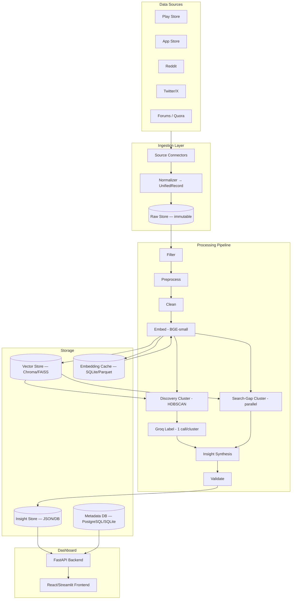
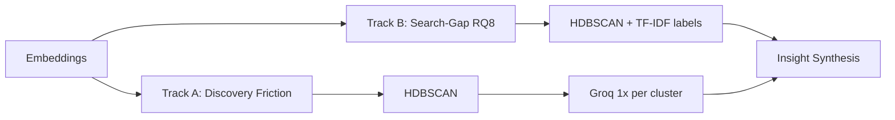
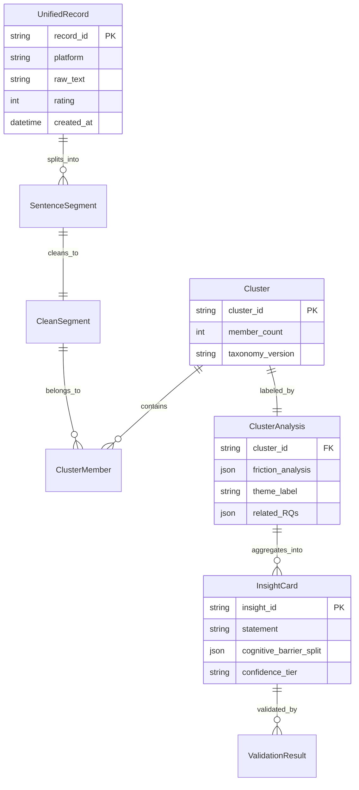
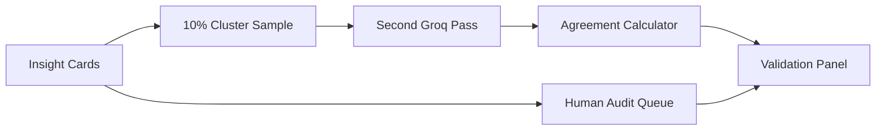

# Architecture: Blinkit Review Analyzer Dashboard

> **Reference:** [Problemstatement.md](./Problemstatement.md)  
> **Goal:** Ingest and analyze public feedback to explain why Blinkit users repeat-buy within categories but rarely cross-shop — and present validated, causal insights in a read-only dashboard (not raw sentiment).

---

## Table of Contents

1. [System Overview](#1-system-overview)
2. [High-Level Architecture](#2-high-level-architecture)
3. [Technology Stack](#3-technology-stack)
4. [Component Design](#4-component-design)
5. [Data Models & Schemas](#5-data-models--schemas)
6. [Pipeline Deep Dive](#6-pipeline-deep-dive)
7. [BGE-small vs Groq Invocation Map](#7-bge-small-vs-groq-invocation-map)
8. [Storage Layer](#8-storage-layer)
9. [Validation Architecture](#9-validation-architecture)
10. [Dashboard Architecture](#10-dashboard-architecture)
11. [Edge-Case Handling Matrix](#11-edge-case-handling-matrix)
12. [Token Cost & Efficiency Strategy](#12-token-cost--efficiency-strategy)
13. [Phased Build Plan](#13-phased-build-plan)
14. [Directory Structure](#14-directory-structure)
15. [Operational Concerns](#15-operational-concerns)

---

## 1. System Overview

The system is a **batch-oriented NLP pipeline** with a **review analyzer dashboard** as the primary deliverable:

| Tier | Role |
|------|------|
| **Ingestion & Normalization** | Pull raw feedback from heterogeneous sources into a unified schema |
| **Intelligence Layer** | BGE-small (local) for embeddings/clustering; Groq (remote) for structured classification/synthesis |
| **Presentation Layer** | Read-only dashboard serving pre-computed insight cards with validation metrics |

### Design Principles

- **Embeddings first, LLM last** — cluster and route cheaply; reserve Groq for one call per cluster
- **Single merged-call rule** — all friction dimensions extracted in one `CrossShoppingFrictionAnalysis` response per cluster
- **Never discard raw text** — filter/tag, don't delete; preserve audit trail
- **Causal over polar** — output cognitive barriers and funnel stages, not "X% negative"
- **Demonstrable validation** — agreement rates and human audits surfaced in the dashboard

---

## 2. High-Level Architecture



### Request Flow Summary

```
Sources → Normalize → Raw Store
  → Filter → Preprocess (record-aware split) → Clean (embed enrichment)
  → Embed (BGE) → Parallel dual-track clustering:
      Track A: Discovery friction (HDBSCAN, non-logistics)
      Track B: Search-gap (regex subset + HDBSCAN, BGE only)
  → Groq Label (1×/cluster, merged schema + theme + RQs)
  → Insight Synthesize → Validate → Insight Store → Dashboard
```

### Data-Driven Design Notes (normalized corpus profile)

Based on analysis of the ~1,200-record reference corpus (`normalized_preview.json`):

| Observation | Pipeline implication |
|-------------|-------------------|
| Most records are **one short sentence** (40–120 chars) | Use **record-aware split**: `<280` chars → single segment |
| ~10% share template skeletons ("never order {category}") | **Tag** near-duplicates (`template_family`); do not hard-delete |
| ~47% contain search-gap language (wish / can't find / missing) | **Parallel search-gap track** (not sequential after main cluster) |
| ~44% mention competitors (Amazon, Zepto, etc.) | Pre-tag in Clean; pass to Groq prompt |
| ~8% Hinglish code-mixed | Tag `hinglish`; **include** in embed/cluster (don't silently drop) |
| Star ratings don't match friction semantics | Never use sentiment; Groq assigns cognitive barriers |
| Expected output scale | ~1,200–1,800 segments → ~40–80 discovery clusters + ~15–30 search-gap clusters |

---

## 3. Technology Stack

| Layer | Technology | Rationale |
|-------|------------|-----------|
| **Language** | Python 3.11+ | Ecosystem for NLP, Pydantic, ML |
| **Embeddings** | `BAAI/bge-small-en-v1.5` via `sentence-transformers` | Local, lightweight, no API cost |
| **LLM** | Groq API (Llama 3.x / Mixtral) | Fast inference, JSON-mode / function-calling |
| **Vector Store** | ChromaDB or FAISS | Local persistence, batch similarity search |
| **Embedding Cache** | SQLite + content-hash keys, or Parquet | Avoid recompute on re-runs |
| **Metadata DB** | SQLite (local) → PostgreSQL (scale) | Records, clusters, runs, validation logs |
| **Clustering** | HDBSCAN (primary), KMeans (fallback) | Density-based; handles noise points |
| **Orchestration** | Python scripts + Makefile / CLI (`typer`) | Batch jobs, no real-time requirement |
| **API** | FastAPI | Serve insight cards, filters, validation stats |
| **Dashboard** | Streamlit (default) or React + Recharts | Primary product — filterable review-insight views |
| **Schema Validation** | Pydantic v2 | `CrossShoppingFrictionAnalysis`, insight cards |

---

## 4. Component Design

### 4.1 Ingestion Layer

**Purpose:** Fetch and normalize heterogeneous feedback into `UnifiedRecord`.

| Connector | Input | Notes |
|-----------|-------|-------|
| `PlayStoreConnector` | Google Play scraper / export | Star rating, date, text, version |
| `AppStoreConnector` | App Store RSS / export | Same fields |
| `RedditConnector` | PRAW / keyword search | Posts + comments; no star rating |
| `TwitterConnector` | API v2 or manual CSV fallback | Rate-limit aware |
| `ForumConnector` | Quora / forum scrapes | HTML-heavy; manual fallback corpus |

**Normalizer responsibilities:**
- Map all sources → `UnifiedRecord` schema
- Assign stable `record_id` (hash of platform + url + timestamp)
- Preserve `raw_text` verbatim in immutable raw store
- Attach `ingestion_run_id` for reproducibility

### 4.2 Filter Module

**Purpose:** Remove noise without losing auditability. The normalized corpus contains thematic template repetition (e.g. "Blinkit is great for groceries but I never think to order {category} here") — these are **valid friction signals**, not spam.

| Rule | Action |
|------|--------|
| Exact duplicate (hash of raw text) | Exclude from pipeline; log count |
| Near-duplicate templates (Jaccard ≥ 0.85 on tokens) | **Keep**; tag `content_tags: ["template_family"]` |
| Bot/generic spam patterns | Exclude; log |
| Empty text | Exclude from embed/classify; log separately |
| Star-only (no text) | Skip embed/LLM; retain for rating-only stats |
| Review-bomb spike | Flag run; don't auto-exclude |

Output: `FilteredRecord` + `filter_audit_log`.

### 4.3 Preprocess Module

**Purpose:** Sentence-level segmentation with **record-aware rules** for short reviews.

| Rule | Implementation |
|------|----------------|
| Short record bypass | If `len(raw_text) < 280` chars → **1 segment = whole record** (avoids over-splitting Twitter/short Play Store reviews) |
| Long record split | `pysbd` or spaCy with emoji-aware rules |
| Min segment length | Merge/drop fragments `< 20` chars |
| Metadata | Retain platform, rating, date, url on every `SentenceSegment` |

- **Output:** `SentenceSegment` — one row per sentence (or whole record), linked to `record_id`

### 4.4 Clean Module

**Purpose:** Normalize text, tag content type, and build **embedding enrichment text**.

| Step | Implementation |
|------|----------------|
| HTML/Markdown strip | `bleach` cleanup (raw_text in store unchanged) |
| Category vocabulary | Rule-based + fuzzy match → `category_mentions[]` |
| Delivery/logistics tag | Keyword classifier → `is_logistics_only: bool` |
| Competitor pre-tag | Alias map → `competitor_mentions_raw[]` |
| Hinglish detection | Script-ratio heuristic; tag `language=hinglish`; exclude only if Devanagari ratio > 90% |
| Embed enrichment | Build `embed_text` (embed-only, not stored as raw): |

```
embed_text = instruction_prefix
           + "[categories: pet_supplies, ...] "
           + "[competitors: Amazon, ...] "
           + normalized_text   # @Blinkit → Blinkit in embed_text only
```

Output: `CleanSegment` with `content_tags[]`, `category_mentions[]`, `is_logistics_only`, `embed_text`.

### 4.5 Embedding Module (BGE-small)

**Purpose:** Vectorize **embed_text** (enriched) at sentence-segment level.

```
Input:  CleanSegment.embed_text (NOT raw_text)
Model:  BAAI/bge-small-en-v1.5
Batch:  64–128 segments per forward pass
Cache:  SHA-256(embed_text + model_version) → vector
Output: float[384] → Vector Store + Embedding Cache
```

**No Groq calls in this step.** Reference corpus: ~1,200–1,800 segments (~10–15 BGE batches).

### 4.6 Clustering Module — Dual-Track (Parallel)

**Purpose:** Group semantically similar segments. Two **parallel** tracks run after embed (not sequential).



#### Track A — Discovery friction (RQ1–7)

| Parameter | Value |
|-----------|-------|
| Input | Embeddings where `is_logistics_only=False` |
| Algorithm | HDBSCAN (`min_cluster_size=3`, `metric=cosine`) |
| Noise points | Assign to nearest cluster or `UNCLUSTERED` |
| Noise fallback | If noise > 25% → KMeans (`k=20`) |
| Dedup merge | Centroid cosine **> 0.90** → merge clusters pre-Groq |
| Expected clusters | ~40–80 (reference corpus) |

#### Track B — Search-gap / inventory void (RQ8)

| Step | Implementation |
|------|----------------|
| 1. Filter | Regex: `wish`, `couldn't find`, `don't have`, `missing`, `not available` |
| 2. Embed | Reuse cached BGE vectors |
| 3. Cluster | HDBSCAN on search-gap subset only |
| 4. Label | Top TF-IDF terms per cluster (**no Groq**) |
| Expected clusters | ~15–30 (reference corpus) |

Output: `Cluster` (track A) + `SearchGapTheme[]` (track B).

### 4.7 Groq Labeling Module (Friction + Funnel + Competitor + Theme)

**Purpose:** One structured LLM call per **discovery** cluster (Track A only).

**Critical constraint:** Exactly **1 Groq call per cluster** returning full `ClusterAnalysis` (friction + theme + RQs).

```
Prompt inputs (per cluster):
  - 5–10 representative segments (truncated)
  - category_mentions distribution (e.g. 70% pet_supplies)
  - platform distribution (play_store, reddit, …) for source-diversity context
  - Pre-detected competitor mentions (from Clean module)
  - Instruction: return JSON matching ClusterAnalysis schema

Groq config:
  - response_format: json_schema (Pydantic export)
  - temperature: 0.1
  - max_tokens: ~512
```

Steps 5, 6, 7, 9 from the problem statement are **one merged response**, not separate passes.

### 4.8 Search-Gap Clustering Module

See **Track B** in §4.6. Runs **in parallel** with discovery clustering after embed. Does not use Groq.

### 4.9 Theme Extraction Module

**Merged into §4.7** — `theme_label`, `related_RQs[]`, and `segment_relevance[]` are fields in the same `ClusterAnalysis` Groq response. Maintains `taxonomy_version` for consistency.

### 4.10 Insight Synthesis Module

**Purpose:** Aggregate cluster-level outputs into ranked insight cards.

**Aggregation logic:**
```
score = frequency × source_diversity_weight × recency_decay

confidence_tier:
  high   → ≥2 platforms AND agreement_rate ≥ 0.7
  medium → 1 platform OR agreement 0.5–0.7
  low    → otherwise OR stale (>12 months)
```

**Insight card fields:** See [Insight Card Schema](#52-insight-card).

**Conflict policy:** Same theme, opposing barriers → emit separate insight cards (segmentation signal for RQ7).

### 4.11 Validation Module

**Purpose:** Demonstrable quality metrics, not claims.

| Check | Method |
|-------|--------|
| Inter-run agreement | Re-sample 10% clusters → second Groq pass → Cohen's κ / agreement % |
| Human spot-audit | Export random N insights → pass/fail form → store in DB |
| Source corroboration | Count distinct `platform` values per insight |
| Staleness | Flag if `latest_evidence_date` > 12 months ago |

Results written to `validation_runs` table and exposed in dashboard.

---

## 5. Data Models & Schemas

### 5.1 UnifiedRecord (Ingestion)

```python
class UnifiedRecord(BaseModel):
    record_id: str
    platform: Literal["play_store", "app_store", "reddit", "twitter", "forum"]
    raw_text: str
    rating: Optional[int] = None          # 1–5; None for Reddit/forums
    created_at: datetime
    url: str
    language: Optional[str] = None
    ingestion_run_id: str
    metadata: dict = Field(default_factory=dict)
```

### 5.2 SentenceSegment (Post-Preprocess)

```python
class SentenceSegment(BaseModel):
    segment_id: str
    record_id: str
    text: str
    sentence_index: int
    platform: str
    rating: Optional[int]
    created_at: datetime
    url: str
```

### 5.3 CleanSegment (Post-Clean)

```python
class CleanSegment(SentenceSegment):
    normalized_text: str
    category_mentions: list[str]       # controlled vocabulary IDs
    content_tags: list[str]            # e.g. "logistics", "discovery", "competitor_compare"
    is_logistics_only: bool
    competitor_mentions_raw: list[str]
    language: str                      # "en", "hinglish", "excluded"
```

### 5.4 CrossShoppingFrictionAnalysis (Groq Output)

```python
class CrossShoppingFrictionAnalysis(BaseModel):
    user_cognitive_barrier: Literal[
        "AWARENESS_DEFICIT", "AUTHENTICITY_DISTRUST", "ASSORTMENT_GAP",
        "CONVENIENCE_MISMATCH", "RETURN_POLICY_ANXIETY", "NONE_GROCERY_LOYAL"
    ]
    funnel_leak_stage: Literal[
        "DISCOVERY", "CONSIDERATION", "CONVERSION", "POST_PURCHASE_RETENTION"
    ]
    competitor_entity: Optional[str] = None
    competitor_advantage: Optional[Literal[
        "ASSORTMENT", "PRICE", "TRUST", "DELIVERY_SPEED", "RETURN_POLICY"
    ]] = None
    price_sensitivity_detected: bool
```

### 5.5 Insight Card (Dashboard Output)

```python
class InsightCard(BaseModel):
    insight_id: str
    statement: str
    related_RQs: list[str]
    theme_tags: list[str]
    evidence_count: int
    source_diversity: int
    cognitive_barrier_split: dict[str, float]   # e.g. {"RETURN_POLICY_ANXIETY": 0.72}
    dominant_funnel_leak_stage: str
    competitor_mentions: list[dict]             # {entity, advantage, count}
    example_snippets: list[str]                 # paraphrased, max 3
    confidence_tier: Literal["high", "medium", "low"]
    segment_relevance: list[str]
    is_stale: bool = False
    taxonomy_version: str
    created_at: datetime
```

### 5.6 Entity Relationship Diagram



---

## 6. Pipeline Deep Dive

### Stage-by-Stage I/O

| Stage | Input | Output | Model |
|-------|-------|--------|-------|
| 1. Filter | `UnifiedRecord[]` | `FilteredRecord[]`, audit log | Exact dedup + template_family tag |
| 2. Preprocess | `FilteredRecord[]` | `SentenceSegment[]` | Record-aware pysbd |
| 3. Clean | `SentenceSegment[]` | `CleanSegment[]` + `embed_text` | Rules + enrichment |
| 4. Embed | `CleanSegment[]` | Vectors in store + cache | **BGE-small** on embed_text |
| 5–7, 9. Groq Label | Discovery `Cluster[]` (Track A) | `ClusterAnalysis[]` | **Groq** (1×/cluster, merged) |
| 8. Search-Gap | `CleanSegment[]` subset (Track B) | `SearchGapTheme[]` | **BGE** + TF-IDF, parallel |
| 10. Synthesize | All analyses + themes | `InsightCard[]` | Python aggregation |
| 11. Validate | Sample of cards/clusters | `ValidationRun` | **Groq** (10% re-sample) + human |
| 12. Dashboard | `InsightCard[]` | Rendered UI | FastAPI + frontend |

### Pipeline Orchestration

```python
# Pseudocode — dual-track batch run
def run_pipeline(ingestion_run_id: str):
    records = load_raw(ingestion_run_id)
    filtered = filter_module.run(records)          # exact dedup; tag template_family
    segments = preprocess_module.run(filtered)     # record-aware split
    clean = clean_module.run(segments)             # embed_text enrichment

    embeddings = embed_module.run(clean, cache=True)   # BGE on embed_text

    # Parallel dual-track clustering
    discovery_clusters = cluster_module.run_discovery(
        embeddings, exclude_logistics=True, min_cluster_size=3, dedup=0.90
    )
    search_gaps = search_gap_module.run(            # Track B — parallel, no Groq
        clean, embeddings, regex_filter=True
    )

    # Groq — ONE call per discovery cluster (Track A only)
    analyses = [
        groq_labeler.label_cluster(cluster)       # merged ClusterAnalysis schema
        for cluster in discovery_clusters
    ]

    insights = synthesize_module.run(analyses, search_gaps)
    validation = validate_module.run(insights, sample_rate=0.10)
    persist(insights, validation)
    return insights
```

---

## 7. BGE-small vs Groq Invocation Map

| Operation | BGE-small | Groq | Notes |
|-----------|:---------:|:----:|-------|
| Sentence embedding | ✅ | ❌ | Batch 64–128; cache by hash |
| Semantic clustering | ✅ | ❌ | HDBSCAN on vectors |
| Theme deduplication | ✅ | ❌ | Centroid cosine > **0.90** → merge pre-Groq |
| Search-gap clustering | ✅ | ❌ | Regex filter + embed + cluster |
| RAG retrieval (representative snippets) | ✅ | ❌ | Top-k diverse segments per cluster |
| Spam/bot detection | ❌ | ❌ | Rule-based only |
| Category vocabulary mapping | ❌ | ❌ | Rule + fuzzy match |
| `user_cognitive_barrier` | ❌ | ✅ | Part of merged call |
| `funnel_leak_stage` | ❌ | ✅ | Part of merged call |
| `competitor_entity/advantage` | ❌ | ✅ | Part of merged call |
| `price_sensitivity_detected` | ❌ | ✅ | Part of merged call |
| `theme_label` + RQ tags | ❌ | ✅ | Same merged call |
| Insight `statement` synthesis | ❌ | ✅ | Optional: 1 call per insight card (not per segment) |
| Example snippet paraphrase | ❌ | ✅ | Batch in synthesis or template |
| Validation re-pass | ❌ | ✅ | 10% cluster sample only |

### Call Budget Formula

```
Groq calls ≈ N_discovery_clusters + (0.10 × N_discovery_clusters)
           ≈ 1.1 × N_discovery_clusters   (Track B search-gap uses zero Groq)

Reference corpus (1,200 records): N_discovery_clusters ≈ 50–70 → ~55–77 Groq calls
NOT: N_segments × 4 fields = catastrophic cost
```

---

## 8. Storage Layer

| Store | Contents | Format |
|-------|----------|--------|
| **Raw Store** | Immutable source records | JSONL / Parquet per ingestion run |
| **Embedding Cache** | `hash(text) → vector` | SQLite BLOB or Parquet |
| **Vector Store** | Segment embeddings + metadata | ChromaDB collection `segments` |
| **Metadata DB** | Records, segments, clusters, analyses, runs | SQLite (local) |
| **Insight Store** | Final `InsightCard[]` + validation | JSON + DB table |
| **Taxonomy Store** | Versioned category/barrier vocab | YAML/JSON `taxonomy_v{semver}.yaml` |

### Indexing Strategy

- `segments`: index on `record_id`, `platform`, `is_logistics_only`
- `clusters`: index on `cluster_id`, `taxonomy_version`
- `insights`: index on `confidence_tier`, `related_RQs`, `dominant_funnel_leak_stage`

---

## 9. Validation Architecture



| Metric | Threshold | Dashboard Display |
|--------|-----------|-------------------|
| Inter-run agreement | Log %; target ≥ 70% | Agreement % gauge |
| Human audit pass rate | Log pass/fail per insight | Audit table |
| High-confidence gate | ≥ 2 source platforms | Badge on insight card |
| Staleness | Evidence > 12 months | Warning icon |
| Conflicting insights | Same theme, different barrier | Both shown; linked |

---

## 10. Dashboard Architecture

### Backend API (FastAPI)

| Endpoint | Purpose |
|----------|---------|
| `GET /api/overview` | Corpus size, source mix, barrier distribution |
| `GET /api/insights` | Paginated insight cards with filters |
| `GET /api/insights/{id}` | Detail + paraphrased evidence |
| `GET /api/charts/barriers` | Cognitive barrier breakdown by category |
| `GET /api/charts/funnel` | Funnel leak stage breakdown |
| `GET /api/charts/competitors` | Competitor × advantage matrix |
| `GET /api/rq/{rq_id}` | Top insights per RQ1–8 |
| `GET /api/segments` | Segment-level view |
| `GET /api/validation` | Agreement %, audit results |

### Filter Parameters

`rq`, `theme`, `barrier`, `funnel_stage`, `confidence`, `segment`, `platform`, `category`, `date_range`

### Frontend Views

| View | Primary Components | Key Rule |
|------|-------------------|----------|
| Overview | KPI cards, source pie, barrier bar | No plain sentiment % |
| Insight Explorer | Filterable table/cards | All filters combinable |
| Cognitive Barrier Chart | Stacked bar by category | Show barrier %, not negative % |
| Funnel Leak Breakdown | Funnel viz | DISCOVERY → RETENTION |
| Competitor Benchmarking | Heatmap / table | Category × competitor × advantage |
| RQ-Mapped View | 8 columns or tabs | Every insight maps to ≥1 RQ |
| Segment View | Grouped cards | RQ7 segmentation |
| Evidence Drill-Down | Paraphrased snippets only | Never verbatim |
| Validation Panel | Agreement + audit log | Demonstrable, not claimed |

### Dashboard Data Contract

The UI **must not render** `sentiment_split` or "% negative". Replace with:

- `cognitive_barrier_split` (stacked %)
- `dominant_funnel_leak_stage` (primary stage badge)
- `competitor_mentions` (entity + advantage)

---

## 11. Edge-Case Handling Matrix

| Edge Case | Detection | Pipeline Action | Storage/Dashboard |
|-----------|-----------|-----------------|-------------------|
| Delivery/logistics confounding discovery | Keyword tagger in Clean | `is_logistics_only=True`; exclude from discovery clusters | Shown in logistics slice; excluded from cross-shop insights |
| Sarcasm / mixed sentiment | Optional: low-confidence flag in Groq | Label with barrier; add `confidence_note` | Medium confidence default |
| Low-volume high-signal niche | HDBSCAN `min_cluster_size=3` | Don't filter by frequency alone | Surface with `low` confidence + `niche` tag |
| Thematic template repetition | Jaccard on token sets | Tag `template_family`; keep in cluster path | Dedup merge at cosine 0.90 |
| Cross-platform contamination (Zepto/Instamart) | Competitor alias map | Extract as `competitor_entity`; separate from Blinkit friction | Competitor benchmarking view |
| Hinglish / code-mixed | Script-ratio heuristic | Tag `hinglish`; include unless Devanagari > 90% | Log hinglish % in overview |
| Review-bombing / spam spikes | Temporal density anomaly | Flag ingestion run; don't auto-delete | Warning banner on overview |
| Missing metadata (Reddit) | `rating=None` | Text-only barrier inference | Omit rating-based filters for Reddit |
| API rate limits | Connector retry + backoff | Fall back to manual CSV corpus | Document in `ingestion_run.metadata` |
| Copyright | Never store/display verbatim in dashboard | Paraphrase in synthesis | `example_snippets` = paraphrased only |
| Stale insights (fixed UX) | `created_at` vs `latest_evidence_date` | `is_stale=True` if > 12 months | Stale badge; deprioritize in ranking |

---

## 12. Token Cost & Efficiency Strategy

### Cost Drivers

| Driver | Mitigation |
|--------|------------|
| Per-segment LLM calls | **Eliminated** — cluster first |
| Multi-pass per cluster (4 fields) | **Eliminated** — single merged JSON schema |
| Long review text in prompts | Truncate to 5–10 representative snippets (~150 tokens each) |
| Re-embedding on re-runs | SHA-256 cache; skip unchanged segments |
| Redundant cluster labeling | Persist `cluster_id → analysis`; skip if taxonomy unchanged |

### Embedding Efficiency

```
Reference corpus:
  Records:        ~1,200
  Segments:       ~1,200–1,800 (mostly 1:1; short-record bypass)
  BGE batches:    ~10–15 forward passes (local, $0)
  Cache hit:      On re-run, ~0 passes for unchanged embed_text

At scale (50K segments):
  BGE batches:  ~391 forward passes
```

### Groq Efficiency

```
Reference corpus:
  Discovery clusters:  ~50–70 (after dedup merge at 0.90)
  Search-gap clusters: ~15–30 (BGE + TF-IDF only)
  Calls per cluster:     1 (merged ClusterAnalysis)
  Validation re-sample:  ~5–7 clusters (10%)
  Total Groq calls:    ~55–77

At scale (~200 discovery clusters):
  Total Groq calls:    ~270 (not 50,000 × 4 = 200,000)
```

### Prompt Token Budget (per cluster)

| Component | Tokens (est.) |
|-----------|---------------|
| System prompt + schema | ~400 |
| 5–10 snippet summaries | ~750 |
| Category + competitor hints | ~100 |
| **Total input** | **~1,250** |
| **Output (JSON)** | **~150** |

**Estimated total:** 270 × 1,400 ≈ **378K tokens per full pipeline run** (vs millions without clustering/merging).

---

## 13. Phased Build Plan

### Phase 1 — Schema & Ingestion (Week 1)

- [ ] Define Pydantic models: `UnifiedRecord`, `CleanSegment`, `CrossShoppingFrictionAnalysis`, `InsightCard`
- [ ] Build source connectors (Play Store, App Store, Reddit minimum)
- [ ] Implement normalizer + immutable raw store
- [ ] CLI: `python -m pipeline ingest --source play_store`

**Exit criteria:** ≥1,000 normalized records in raw store; schema validated.

### Phase 2 — Clean & Embed (Week 2)

- [ ] Filter: exact dedup + `template_family` near-dup tagging
- [ ] Preprocess: record-aware split (`<280` chars → single segment; min 20 chars)
- [ ] Clean: category/competitor tags + `embed_text` enrichment
- [ ] BGE-small on `embed_text` with batch + cache
- [ ] ChromaDB vector store populated

**Exit criteria:** Embeddings for 100% of non-excluded segments; cache hit on re-run.

### Phase 3 — Cluster & Groq Label (Week 3)

- [ ] **Dual-track clustering**: Discovery (Track A) + Search-gap (Track B) in parallel
- [ ] HDBSCAN `min_cluster_size=3`, dedup merge at cosine 0.90
- [ ] Groq merged `ClusterAnalysis` (1 call/cluster) with category + platform stats in prompt
- [ ] Search-gap TF-IDF labels (zero Groq)

**Exit criteria:** All discovery clusters labeled; Groq call count ≈ 1.0–1.1 × N_clusters.

### Phase 4 — Synthesis & Validation (Week 4)

- [ ] Insight card aggregation + ranking formula
- [ ] Validation module (10% re-sample + agreement log)
- [ ] Human audit export (CSV/form)
- [ ] Paraphrase pipeline for evidence snippets

**Exit criteria:** Insight cards with confidence tiers; agreement % logged.

### Phase 5 — Review Analyzer Dashboard (Week 5)

- [ ] FastAPI endpoints
- [ ] Streamlit/React frontend with all 9 views
- [ ] Validation panel
- [ ] Cognitive barrier + funnel charts (no sentiment %)

**Exit criteria:** End-to-end run from raw ingest to live review analyzer dashboard.

---

## 14. Directory Structure

```
blinkit-review-analyzer/
├── architecture.md
├── Problemstatement.md
├── pyproject.toml
├── Makefile
├── config/
│   ├── taxonomy_v1.yaml
│   ├── category_vocabulary.yaml
│   └── competitor_aliases.yaml
├── src/
│   ├── ingestion/
│   │   ├── connectors/
│   │   ├── normalizer.py
│   │   └── raw_store.py
│   ├── pipeline/
│   │   ├── filter.py
│   │   ├── preprocess.py
│   │   ├── clean.py
│   │   ├── embed.py          # BGE-small
│   │   ├── cluster.py
│   │   ├── groq_labeler.py   # 1 call/cluster
│   │   ├── search_gap.py     # BGE only
│   │   ├── synthesize.py
│   │   └── validate.py
│   ├── models/
│   │   ├── records.py
│   │   ├── friction.py       # CrossShoppingFrictionAnalysis
│   │   └── insights.py
│   ├── storage/
│   │   ├── vector_store.py
│   │   ├── embedding_cache.py
│   │   └── metadata_db.py
│   └── api/
│       ├── main.py           # FastAPI
│       └── routes/
├── dashboard/
│   └── app.py                # Streamlit entry
├── data/
│   ├── raw/
│   ├── processed/
│   └── insights/
├── scripts/
│   ├── run_pipeline.py
│   └── export_audit_sample.py
└── tests/
    ├── test_filter.py
    ├── test_embed_cache.py
    ├── test_groq_schema.py
    └── test_synthesis.py
```

---

## 15. Operational Concerns

### Configuration & Secrets

| Secret | Storage |
|--------|---------|
| `GROQ_API_KEY` | `.env` (never committed) |
| Reddit/Twitter credentials | `.env` |
| Model paths | `config/settings.yaml` |

### Reproducibility

- Every pipeline run gets `run_id`, `taxonomy_version`, `model_versions`
- Raw store is append-only
- Cluster → analysis mapping persisted for audit

### Monitoring (Batch)

- Log: segments processed, cache hit rate, clusters formed, Groq calls made, tokens used
- Alert: Groq call count > 1.2 × cluster count (signals merged-call violation)

### Out of Scope (review analyzer dashboard)

- Real-time streaming ingestion
- Full multilingual beyond English + Hinglish
- In-app product changes or feature rollout (analysis and dashboard only)
- Paid social-listening tools

---

## Appendix: Research Question → Pipeline Mapping

| RQ | Primary Pipeline Stages | Key Output Field |
|----|-------------------------|------------------|
| RQ1 | Groq Label, Competitor Benchmark | `NONE_GROCERY_LOYAL`, competitor triplets |
| RQ2 | Groq Label (Friction) | `user_cognitive_barrier` |
| RQ3 | Groq Label (Funnel) | `funnel_leak_stage` |
| RQ4 | Groq Label, Theme Extract | `NONE_GROCERY_LOYAL`, reorder themes |
| RQ5 | Groq Label | `AUTHENTICITY_DISTRUST`, trust themes |
| RQ6 | Groq Label, Synthesis | All barrier types, frequency rank |
| RQ7 | Synthesis (conflict policy) | Separate insight cards per segment |
| RQ8 | Search-Gap Cluster, Groq Label | Inventory void themes, `ASSORTMENT_GAP` |

---

*Document version: 1.0 — aligned with Problemstatement.md*
