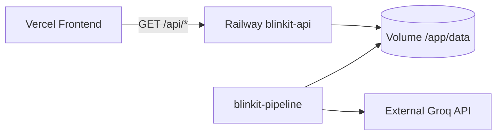

# Backend Deployment Plan — Railway

> **Stack:** FastAPI + Uvicorn · Docker (`api` target)  
> **Code:** `src/api/main.py`, `src/api/routes/insights.py`  
> **Data:** `data/insights/insights_run_phase4_final.json` (117 insights)  
> **Frontend:** [deployment-plan-frontend-vercel.md](./deployment-plan-frontend-vercel.md)  
> **Stitch UI:** `stitch/` (from `stitch_blinkit_review_analyzer_dashboard.zip`)  
> **Last updated:** 2026-07-27 · **Status:** API implemented, ready to deploy

---

## Table of Contents

1. [Overview](#1-overview)
2. [API Endpoints](#2-api-endpoints)
3. [Prerequisites](#3-prerequisites)
4. [Deploy blinkit-api](#4-deploy-blinkit-api)
5. [Seed Data on Volume](#5-seed-data-on-volume)
6. [Environment Variables](#6-environment-variables)
7. [Verify Deployment](#7-verify-deployment)
8. [Pipeline Worker (Optional)](#8-pipeline-worker-optional)
9. [Frontend Integration Map](#9-frontend-integration-map)
10. [Local Development](#10-local-development)
11. [Security](#11-security)
12. [Troubleshooting](#12-troubleshooting)
13. [Rollback & Cost](#13-rollback--cost)

---

## 1. Overview

Railway hosts the **read-only FastAPI API**. The batch NLP pipeline (BGE, Groq) runs separately — never on HTTP requests.

| Service | Purpose | Docker target | Always on? |
|---------|---------|---------------|------------|
| **blinkit-api** | Dashboard REST API | `Dockerfile` → `api` | Yes |
| **blinkit-pipeline** | Batch re-runs | `Dockerfile` → `pipeline` | On demand |



---

## 2. API Endpoints

All routes implemented in `src/api/routes/insights.py`. Tested via `tests/test_api.py`.

| Method | Path | Frontend page | Wired? |
|--------|------|---------------|--------|
| GET | `/health` | Railway health check | — |
| GET | `/api/overview` | `/` Overview | Yes |
| GET | `/api/insights` | `/insights` Explorer | Yes |
| GET | `/api/insights/{id}` | `/evidence?id=` | Yes |
| GET | `/api/charts/barriers` | `/barriers` | API ready, UI pending |
| GET | `/api/charts/funnel` | `/funnel` TBD | No page yet |
| GET | `/api/charts/competitors` | `/competitors` TBD | No page yet |
| GET | `/api/rq/{rq_id}` | `/rq` TBD | No page yet |
| GET | `/api/segments` | `/segments` TBD | No page yet |
| GET | `/api/validation` | `/validation` TBD | No page yet |

### `GET /api/insights` query params

`page`, `page_size`, `rq`, `theme`, `barrier`, `funnel_stage`, `confidence`, `segment`, `q`

### `GET /api/overview` response (reference run)

```json
{
  "run_id": "run_phase4_final",
  "insight_count": 117,
  "evidence_mentions": 1847,
  "high_confidence_pct": 70.9,
  "agreement_rate": 0.8182,
  "stale_count": 117,
  "confidence_tiers": { "high": 83, "medium": 34 },
  "barrier_distribution": { "ASSORTMENT_GAP": 95.0, ... },
  "top_insights": [ ... ]
}
```

---

## 3. Prerequisites

- [x] FastAPI app at `src/api/main.py`
- [x] `Dockerfile` with `api` target + `$PORT` binding
- [x] `railway.toml` with `/health` check
- [x] Pipeline complete: `insights_run_phase4_final.json` (117 cards)
- [ ] GitHub repo pushed
- [ ] Railway account linked to GitHub
- [ ] Vercel URL known (for `CORS_ORIGINS`)

**Files required on Railway volume:**

| File | Path on volume |
|------|----------------|
| Insight cards | `/app/data/insights/insights_run_phase4_final.json` |
| Validation | `/app/data/processed/validation_run_phase4_final.json` |
| Summary | `/app/data/processed/synthesize_validate_summary_run_phase4_final.json` |

---

## 4. Deploy blinkit-api

### Step 1 — Create Railway project

1. [railway.app](https://railway.app) → **New Project** → **Deploy from GitHub repo**
2. Select **Blinkit** repository
3. Rename service to **`blinkit-api`**

### Step 2 — Build config

Railway auto-reads `railway.toml` at repo root:

```toml
[build]
builder = "DOCKERFILE"
dockerfilePath = "Dockerfile"
dockerBuildTarget = "api"

[deploy]
healthcheckPath = "/health"
healthcheckTimeout = 30
restartPolicyType = "ON_FAILURE"
```

Dockerfile `api` target:
- Sets `PYTHONPATH=/app/src`
- Installs FastAPI + Uvicorn only (no ML stack)
- Binds `uvicorn api.main:app --host 0.0.0.0 --port $PORT`

### Step 3 — Attach volume

1. Service → **Volumes** → **Add Volume**
2. Mount path: **`/app/data`**
3. Size: **1 GB**

### Step 4 — Set environment variables

See [§6](#6-environment-variables). Minimum:

```
BLINKIT_DATA_DIR=/app/data
INSIGHTS_RUN_ID=run_phase4_final
CORS_ORIGINS=https://your-app.vercel.app
```

### Step 5 — Seed data

See [§5](#5-seed-data-on-volume).

### Step 6 — Generate domain

Settings → Networking → **Generate Domain**  
Example: `https://blinkit-api-production.up.railway.app`

Copy this URL into:
- Vercel `vercel.json` → `/api/:path*` proxy destination
- Railway `CORS_ORIGINS` (if frontend calls API directly)

### Step 7 — Verify

See [§7](#7-verify-deployment).

---

## 5. Seed Data on Volume

### Option A — Railway CLI upload (recommended)

```bash
npm i -g @railway/cli
railway login
railway link                    # select blinkit-api

# Create dirs on volume
railway run -- mkdir -p /app/data/insights /app/data/processed
```

Upload from local machine (PowerShell, repo root):

```powershell
# Copy files into running container — adjust service name as needed
railway shell
# Inside shell:
#   Use railway's file upload or paste JSON via heredoc for MVP
```

**Practical MVP:** use Option B for first deploy, migrate to volume later.

### Option B — Bake into Docker image (first deploy only)

Add to `Dockerfile` `api` stage temporarily:

```dockerfile
COPY data/insights/insights_run_phase4_final.json /app/data/insights/
COPY data/processed/validation_run_phase4_final.json /app/data/processed/
COPY data/processed/synthesize_validate_summary_run_phase4_final.json /app/data/processed/
```

> Remove before production scale — prefer volume so pipeline can update data without rebuild.

### Option C — Shared volume with pipeline worker

Run pipeline on `blinkit-pipeline` service; output writes to same `/app/data` volume. API reads new files when `INSIGHTS_RUN_ID` is updated.

---

## 6. Environment Variables

| Variable | Example | Required | Notes |
|----------|---------|----------|-------|
| `PORT` | Auto | Yes | Set by Railway |
| `BLINKIT_DATA_DIR` | `/app/data` | Yes | Must match volume mount |
| `INSIGHTS_RUN_ID` | `run_phase4_final` | Yes | Matches `insights_<run_id>.json` |
| `CORS_ORIGINS` | `https://blinkit.vercel.app,http://localhost:3000` | Yes | Comma-separated Vercel URLs |
| `LOG_LEVEL` | `INFO` | No | |
| `ENABLE_OPENAPI` | `false` | No | Set `true` in staging for `/docs` |

**Never set on API service:** `GROQ_API_KEY`, Reddit/Twitter tokens.

---

## 7. Verify Deployment

```bash
export API=https://blinkit-api-production.up.railway.app

curl -s $API/health
# {"status":"ok"}

curl -s $API/api/overview | jq '.insight_count, .agreement_rate, .high_confidence_pct'
# 117
# 0.8182
# 70.9

curl -s "$API/api/insights?page=1&page_size=3" | jq '.total, .items[0].statement'
# 117
# "Missing personal care products: 23 feedback mentions..."

curl -s $API/api/insights/392c450713a1ebe0 | jq '.confidence_tier, .example_snippets | length'
# "high"
# 3

curl -s $API/api/charts/barriers | jq '.raw'
# {"ASSORTMENT_GAP": 95, ...}
```

**From Vercel (proxy path):**

```bash
curl -s https://your-app.vercel.app/api/overview | jq '.insight_count'
# 117
```

---

## 8. Pipeline Worker (Optional)

Second Railway service for batch re-runs. Config: `deploy/railway.pipeline.toml`.

| Setting | Value |
|---------|-------|
| Docker target | `pipeline` |
| Volume | Same `/app/data` as API |
| Restart policy | `NEVER` |
| RAM | 2–4 GB |
| Env | `GROQ_API_KEY`, `BLINKIT_DATA_DIR=/app/data` |

Trigger:

```bash
python scripts/run_pipeline.py --run-id run_phase5_001 --stage all
```

After completion:
1. Set `INSIGHTS_RUN_ID=run_phase5_001` on `blinkit-api`
2. Redeploy API (env-only change, no rebuild)

---

## 9. Frontend Integration Map

| Vercel route | JS module | API endpoint | Status |
|--------------|-----------|--------------|--------|
| `/` | `js/pages/overview.js` | `/api/overview` | Live |
| `/insights` | `js/pages/insights.js` | `/api/insights` | Live |
| `/evidence?id=` | `js/pages/evidence.js` | `/api/insights/{id}` | Live |
| `/barriers` | *(pending)* | `/api/charts/barriers` | Static HTML only |

Vercel proxies `/api/*` → Railway (see `frontend/vercel.json`). When using proxy, frontend `config.js` can use empty `API_URL` (same-origin).

---

## 10. Local Development

**PowerShell (Windows):**

```powershell
cd e:\Blinkit
$env:PYTHONPATH="src"
$env:BLINKIT_DATA_DIR="data"
$env:INSIGHTS_RUN_ID="run_phase4_final"
$env:CORS_ORIGINS="http://localhost:3000"
uvicorn api.main:app --reload --port 8000
```

**Bash:**

```bash
export PYTHONPATH=src BLINKIT_DATA_DIR=data INSIGHTS_RUN_ID=run_phase4_final
export CORS_ORIGINS=http://localhost:3000
uvicorn api.main:app --reload --port 8000
```

Run tests:

```bash
pytest tests/test_api.py -v
```

Pair with frontend: `cd frontend && npm run dev` → http://localhost:3000

---

## 11. Security

- [ ] `CORS_ORIGINS` — explicit Vercel domains only (no `*`)
- [ ] GET-only public routes
- [ ] `GROQ_API_KEY` on pipeline service only
- [ ] `ENABLE_OPENAPI=false` in production
- [ ] No `raw_text` in API responses
- [ ] No `sentiment_split` in responses (enforced in tests)

---

## 12. Troubleshooting

| Symptom | Cause | Fix |
|---------|-------|-----|
| `/health` OK, `/api/overview` 500 | Missing data files | Seed volume; check `BLINKIT_DATA_DIR` |
| `insight_count: 0` | Wrong `INSIGHTS_RUN_ID` | Must match `insights_<run_id>.json` filename |
| CORS error from browser | Missing Vercel origin | Add URL to `CORS_ORIGINS`; or use Vercel proxy |
| 502 Bad Gateway | Port mismatch | Dockerfile must use `${PORT}` |
| Import error on deploy | Missing `config/` | Dockerfile copies `config/` — verify build logs |
| Frontend shows "API Error" | Railway down or proxy URL wrong | Check `vercel.json` destination URL |

---

## 13. Rollback & Cost

**Rollback:**
1. Railway → Deployments → previous image → Rollback
2. Or change `INSIGHTS_RUN_ID` to prior run (e.g. `run_phase4_001`)

**Cost (MVP):**

| Resource | ~Monthly |
|----------|----------|
| API (512 MB–1 GB) | $5 |
| 1 GB volume | $0.25 |
| Pipeline (on demand) | $1–5/run |
| **Total** | **$5–10** |

---

*Deploy frontend next: [deployment-plan-frontend-vercel.md](./deployment-plan-frontend-vercel.md)*
