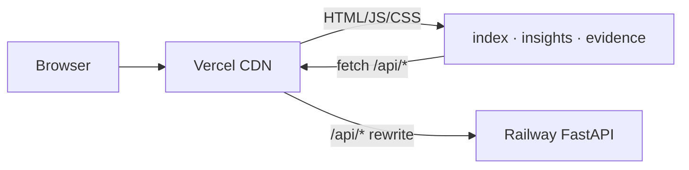

# Frontend Deployment Plan — Vercel

> **Stack:** Google Stitch static HTML + Tailwind CDN + vanilla JS  
> **Deploy root:** `frontend/` · **Static files:** `frontend/public/`  
> **Stitch source:** `stitch/` (extracted from `stitch_blinkit_review_analyzer_dashboard.zip`)  
> **Backend:** [deployment-plan-backend-railway.md](./deployment-plan-backend-railway.md)  
> **Design tokens:** `frontend/DESIGN.md`  
> **Last updated:** 2026-07-27 · **Status:** 3/5 Stitch screens API-wired, ready to deploy

---

## Table of Contents

1. [Overview](#1-overview)
2. [Page Status](#2-page-status)
3. [Repository Layout](#3-repository-layout)
4. [Prerequisites](#4-prerequisites)
5. [Deploy to Vercel](#5-deploy-to-vercel)
6. [API Connection](#6-api-connection)
7. [Live Pages (Implemented)](#7-live-pages-implemented)
8. [Pending Pages](#8-pending-pages)
9. [Local Development](#9-local-development)
10. [Stitch Re-sync Workflow](#10-stitch-re-sync-workflow)
11. [Pre-Deploy Checklist](#11-pre-deploy-checklist)
12. [Smoke Tests](#12-smoke-tests)
13. [Troubleshooting](#13-troubleshooting)
14. [Rollback & Cost](#14-rollback--cost)

---

## 1. Overview

Vercel serves the **Stitch-exported static dashboard** from `frontend/public/`. No Next.js — build step only injects the Railway API URL into `config.js`.



**Deploy order:** Railway API first → update `vercel.json` proxy → deploy Vercel.

---

## 2. Page Status

| Vercel URL | File | Stitch source | API wired | Notes |
|------------|------|---------------|-----------|-------|
| `/` | `index.html` | `overview_dashboard` | **Yes** | KPIs, barriers, top-5 table |
| `/insights` | `insights.html` | `insight_explorer` | **Yes** | Filters, pagination, search |
| `/evidence?id=` | `evidence.html` | `evidence_drill_down_panel` | **Yes** | Drawer from `?id=` param |
| `/barriers` | `barriers.html` | `cognitive_barrier_chart` | No | Static mockup — wire next |
| `/shell` | `shell.html` | `app_shell` | — | Reference layout only |
| `/funnel` | — | Not in Stitch | — | TBD |
| `/competitors` | — | Not in Stitch | — | TBD |
| `/rq` | — | Not in Stitch | — | TBD |
| `/segments` | — | Not in Stitch | — | TBD |
| `/validation` | — | Not in Stitch | — | TBD |

---

## 3. Repository Layout

```
Blinkit/
├── stitch_blinkit_review_analyzer_dashboard.zip   # Stitch archive (repo root)
├── stitch/                                        # Extracted Stitch source (design reference)
│   ├── overview_dashboard/code.html
│   ├── insight_explorer/code.html
│   ├── cognitive_barrier_chart/code.html
│   ├── evidence_drill_down_panel/code.html
│   └── blinkit_review_analyzer/DESIGN.md
└── frontend/                                      # ← Vercel Root Directory
    ├── DESIGN.md
    ├── package.json
    ├── vercel.json                                # Routes + /api proxy to Railway
    ├── scripts/inject-env.js                      # Build-time config injection
    └── public/
        ├── index.html                             # Overview (API wired)
        ├── insights.html                          # Explorer (API wired)
        ├── evidence.html                          # Drill-down (API wired)
        ├── barriers.html                          # Static (pending wire)
        ├── shell.html
        └── js/
            ├── config.template.js                 # Template (do not edit directly)
            ├── config.js                          # Generated at build
            ├── api.js                             # BlinkitAPI client
            ├── shared.js                          # Labels, badges, nav
            └── pages/
                ├── overview.js                    # GET /api/overview
                ├── insights.js                    # GET /api/insights
                └── evidence.js                    # GET /api/insights/{id}
```

---

## 4. Prerequisites

- [ ] Railway API live — `/health` and `/api/overview` return data
- [ ] Railway public URL copied
- [ ] Vercel account linked to GitHub
- [ ] `frontend/` committed (including `public/js/pages/*.js`)
- [ ] Node.js 20.x available locally (for `npm run dev`)

---

## 5. Deploy to Vercel

### Step 1 — Import project

1. [vercel.com/new](https://vercel.com/new) → Import **Blinkit** repo
2. **Root Directory:** `frontend` ← required
3. Framework Preset: **Other**

### Step 2 — Build settings

| Setting | Value |
|---------|-------|
| Root Directory | `frontend` |
| Build Command | `npm run build` |
| Output Directory | `public` |
| Install Command | `npm install` |
| Node.js Version | 20.x |

`npm run build` runs `scripts/inject-env.js` → writes `public/js/config.js`.

### Step 3 — Environment variables

**Production**

| Variable | Value | Notes |
|----------|-------|-------|
| `RAILWAY_API_URL` | *(leave empty)* | Use Vercel proxy (recommended) |
| `INSIGHTS_RUN_ID` | `run_phase4_final` | Optional, shown in config |

**Alternative (direct API, no proxy):**

| Variable | Value |
|----------|-------|
| `RAILWAY_API_URL` | `https://blinkit-api-production.up.railway.app` |

Then also set Railway `CORS_ORIGINS` to your Vercel domain.

### Step 4 — Update `vercel.json` proxy

Replace placeholder Railway URL with your deployed domain:

```json
{
  "rewrites": [
    { "source": "/", "destination": "/index.html" },
    { "source": "/insights", "destination": "/insights.html" },
    { "source": "/barriers", "destination": "/barriers.html" },
    { "source": "/evidence", "destination": "/evidence.html" },
    {
      "source": "/api/:path*",
      "destination": "https://<your-railway-domain>/api/:path*"
    }
  ]
}
```

Commit and push — Vercel redeploys automatically.

### Step 5 — Deploy

Push to `main` or click **Deploy** in Vercel dashboard.

Note production URL: e.g. `https://blinkit-review-analyzer.vercel.app`

### Step 6 — Update Railway CORS (if using direct API)

Only needed when `RAILWAY_API_URL` is set (Strategy B). With proxy (Strategy A), skip this.

```
CORS_ORIGINS=https://blinkit-review-analyzer.vercel.app
```

---

## 6. API Connection

### Strategy A — Vercel proxy (recommended)

| Setting | Value |
|---------|-------|
| `vercel.json` | `/api/:path*` → Railway |
| `RAILWAY_API_URL` | empty |
| `config.js` | `API_URL: ""` → browser calls same-origin `/api/...` |
| CORS | Not needed |

```
Browser → https://app.vercel.app/api/overview
       → Vercel rewrite → Railway
```

### Strategy B — Direct Railway URL

| Setting | Value |
|---------|-------|
| `RAILWAY_API_URL` | `https://blinkit-api-production.up.railway.app` |
| Railway `CORS_ORIGINS` | Must include Vercel domain |

### BlinkitAPI client (`public/js/api.js`)

```javascript
BlinkitAPI.overview()                          // GET /api/overview
BlinkitAPI.insights({ page, barrier, q, ... }) // GET /api/insights
BlinkitAPI.insight(id)                         // GET /api/insights/{id}
BlinkitAPI.barriers()                          // GET /api/charts/barriers
BlinkitAPI.validation()                        // GET /api/validation
```

Every wired page includes:

```html
<script src="/js/config.js"></script>
<script src="/js/api.js"></script>
<script src="/js/shared.js"></script>
<script src="/js/pages/overview.js"></script>  <!-- page-specific -->
```

---

## 7. Live Pages (Implemented)

### Overview (`/`)

**Script:** `js/pages/overview.js`  
**API:** `GET /api/overview`

| UI element | Data field |
|------------|------------|
| Total Insights KPI | `insight_count` |
| Evidence Mentions KPI | `evidence_mentions` |
| Source Platforms KPI | `max_source_diversity` |
| High-Confidence KPI | `high_confidence_pct` |
| Agreement label | `agreement_rate` |
| Stale banner | `stale_count` |
| Confidence chart | `confidence_tiers` |
| Barrier bars | `barrier_distribution` |
| Top 5 table | `top_insights[]` |

Search bar → redirects to `/insights?q=...`

### Insight Explorer (`/insights`)

**Script:** `js/pages/insights.js`  
**API:** `GET /api/insights`

| Feature | Param |
|---------|-------|
| RQ filter chips | `rq=RQ1` … `rq=RQ8` |
| Barrier dropdown | `barrier=ASSORTMENT_GAP` |
| Funnel dropdown | `funnel_stage=DISCOVERY` |
| Confidence dropdown | `confidence=high` |
| Segment dropdown | `segment=frequent_grocery_buyers` |
| Search (debounced) | `q=` |
| Pagination | `page`, `page_size=12` |

Card click → `/evidence?id={insight_id}`

### Evidence Drill-Down (`/evidence?id=`)

**Script:** `js/pages/evidence.js`  
**API:** `GET /api/insights/{id}`

| Section | Data field |
|---------|------------|
| Statement | `statement` |
| Confidence badge | `confidence_tier` |
| Stale badge | `is_stale` |
| Funnel stage | `dominant_funnel_leak_stage` |
| Barrier breakdown bar | `cognitive_barrier_split` |
| Paraphrased quotes (max 3) | `example_snippets[]` |
| Competitor table | `competitor_mentions[]` |
| RQ tags | `related_RQs[]` |

Close button → back to `/insights.html` or `/`

---

## 8. Pending Pages

| Page | Next step |
|------|-----------|
| `/barriers` | Create `js/pages/barriers.js` → `BlinkitAPI.barriers()` |
| `/funnel` | Export from Stitch or clone barrier layout → `BlinkitAPI.funnel()` |
| `/validation` | Export from Stitch → `BlinkitAPI.validation()` |
| Others | API endpoints exist on Railway — UI not in Stitch zip |

---

## 9. Local Development

**Terminal 1 — API (repo root):**

```powershell
$env:PYTHONPATH="src"
$env:BLINKIT_DATA_DIR="data"
$env:INSIGHTS_RUN_ID="run_phase4_final"
$env:CORS_ORIGINS="http://localhost:3000"
uvicorn api.main:app --reload --port 8000
```

**Terminal 2 — Frontend:**

```bash
cd frontend
npm install
npm run dev
# inject-env sets API_URL=http://localhost:8000
# → http://localhost:3000
```

**Verify locally:**

| URL | Expected |
|-----|----------|
| http://localhost:3000/ | KPIs show 117 insights |
| http://localhost:3000/insights.html | Card grid loads |
| http://localhost:3000/evidence.html?id=392c450713a1ebe0 | Drawer with paraphrased snippets |

---

## 10. Stitch Re-sync Workflow

When you export a new zip from Google Stitch:

1. Replace `stitch_blinkit_review_analyzer_dashboard.zip` at repo root
2. Extract to `stitch/`:
   ```powershell
   Expand-Archive stitch_blinkit_review_analyzer_dashboard.zip -DestinationPath _tmp -Force
   Copy-Item _tmp\stitch_blinkit_review_analyzer_dashboard\* stitch\ -Recurse -Force
   Remove-Item _tmp -Recurse -Force
   ```
3. Merge visual HTML changes into `frontend/public/*.html`
4. **Preserve** on every page:
   - `<script src="/js/...">` tags at bottom
   - `data-kpi`, `#insights-grid`, `#barrier-chart`, etc.
   - Sidebar links: `/`, `/insights.html`, `/barriers.html`
5. Do **not** overwrite `frontend/public/js/` — that is the API layer

See also: `stitch/README.md`

---

## 11. Pre-Deploy Checklist

- [ ] Railway API deployed and returning 117 insights
- [ ] `vercel.json` proxy URL updated to real Railway domain
- [ ] Vercel Root Directory = `frontend`
- [ ] Build command = `npm run build`, output = `public`
- [ ] Overview shows live KPIs (not mock "1.2M")
- [ ] Insight Explorer paginates and filters work
- [ ] Evidence page loads from card click
- [ ] No secrets in client JS or HTML
- [ ] No `sentiment_split` or "% negative" in UI

---

## 12. Smoke Tests (Production)

| # | Action | Pass criteria |
|---|--------|---------------|
| 1 | Open `/` | KPI "Total Insights" = 117 |
| 2 | Open `/insights` | Cards render with real statements |
| 3 | Filter RQ1 chip | Grid updates, count changes |
| 4 | Search "pet" | Filtered results |
| 5 | Click "View Details" | `/evidence?id=...` loads |
| 6 | Evidence page | 3 paraphrased snippets, no raw reviews |
| 7 | DevTools Network | `/api/overview` returns 200 |
| 8 | `/api/overview` via Vercel proxy | Same JSON as Railway direct |

---

## 13. Troubleshooting

| Issue | Fix |
|-------|-----|
| KPIs show "—" | API unreachable — check Railway + `vercel.json` proxy |
| CORS error | Use proxy (empty `RAILWAY_API_URL`) or fix `CORS_ORIGINS` |
| 404 on `/insights` | Check `vercel.json` rewrites; output dir = `public` |
| Mock data still visible | Old deploy — verify `overview.js` loaded in DevTools |
| `config.js` shows `__API_URL__` | Run `npm run build` before deploy |
| Tailwind unstyled | CDN blocked — allow `cdn.tailwindcss.com` |
| Evidence "Missing insight id" | URL must include `?id=<insight_id>` |

---

## 14. Rollback & Cost

**Rollback:** Vercel → Deployments → previous → Promote to Production (instant).

**Cost:**

| Tier | Cost |
|------|------|
| Vercel Hobby | $0 |
| Vercel Pro (team) | $20/mo |

---

## Design rules (from `DESIGN.md`)

- Primary accent: `#FFE141` · Background: `#F9F9F9` · Font: Inter
- Never render `sentiment_split` or "% negative"
- Show `cognitive_barrier_split` and funnel stages only
- Evidence = paraphrased snippets (max 3), never verbatim reviews

---

*Deploy backend first: [deployment-plan-backend-railway.md](./deployment-plan-backend-railway.md)*
