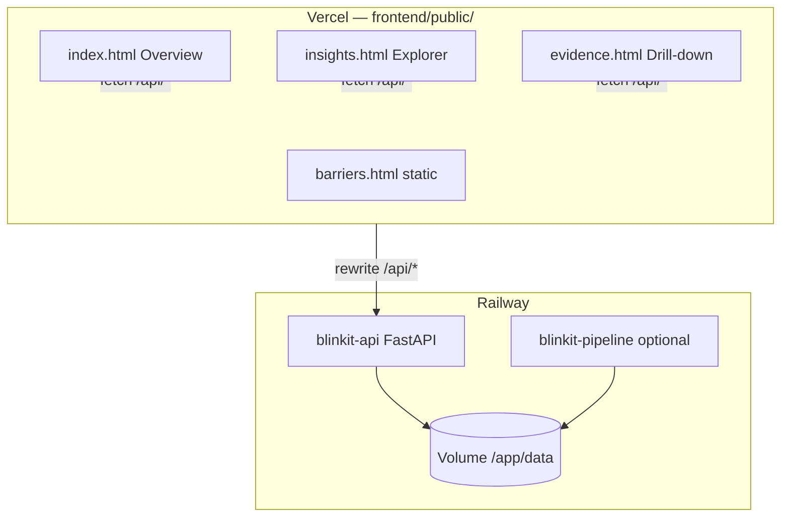

# Deployment Plan — Blinkit Review Analyzer

> **UI:** Google Stitch → `stitch_blinkit_review_analyzer_dashboard.zip`  
> **Last updated:** 2026-07-27 · **Status:** Backend + 3 frontend pages ready to deploy

---

## Split guides

| Layer | Platform | Document |
|-------|----------|----------|
| **Backend API** | Railway | **[deployment-plan-backend-railway.md](./deployment-plan-backend-railway.md)** |
| **Frontend dashboard** | Vercel | **[deployment-plan-frontend-vercel.md](./deployment-plan-frontend-vercel.md)** |

---

## Architecture



| Component | Location | Platform |
|-----------|----------|----------|
| Stitch design source | `stitch/` + `.zip` | — |
| Deployable frontend | `frontend/public/` | Vercel |
| FastAPI | `src/api/main.py` | Railway |
| Insight data | `insights_run_phase4_final.json` (117 cards) | Railway volume |
| Pipeline worker | `scripts/run_pipeline.py` | Railway (optional) |

---

## Current implementation status

### Backend (Railway) — ready

| Item | Status |
|------|--------|
| FastAPI app + all `/api/*` routes | Done |
| `/health` for Railway | Done |
| Docker `api` target | Done |
| `railway.toml` | Done |
| API tests (`tests/test_api.py`) | Done |
| Volume seeding | Manual step at deploy |

### Frontend (Vercel) — partially wired

| Page | Route | API | Status |
|------|-------|-----|--------|
| Overview | `/` | `/api/overview` | **Live** |
| Insight Explorer | `/insights` | `/api/insights` | **Live** |
| Evidence drill-down | `/evidence?id=` | `/api/insights/{id}` | **Live** |
| Barrier Chart | `/barriers` | `/api/charts/barriers` | Static only |
| Funnel, Competitor, RQ, Segments, Validation | — | API ready | Not in Stitch zip |

---

## Deploy order (≈25 min total)

### 1. Railway backend (~15 min)

```powershell
# Local verify first
$env:PYTHONPATH="src"; $env:BLINKIT_DATA_DIR="data"; $env:INSIGHTS_RUN_ID="run_phase4_final"
uvicorn api.main:app --port 8000
# curl http://localhost:8000/api/overview  → insight_count: 117
```

Then:
1. Create Railway project → deploy `blinkit-api` (Docker target `api`)
2. Mount volume at `/app/data`, seed insight JSON files
3. Set env: `BLINKIT_DATA_DIR`, `INSIGHTS_RUN_ID`, `CORS_ORIGINS`
4. Generate public domain → copy URL

Full steps: **[Backend plan §4](./deployment-plan-backend-railway.md#4-deploy-blinkit-api)**

### 2. Vercel frontend (~10 min)

1. Update `frontend/vercel.json` → replace Railway URL in `/api/:path*` proxy
2. Import repo → Root Directory = **`frontend`**
3. Build: `npm run build` · Output: **`public`**
4. Deploy → smoke test (see checklist below)

Full steps: **[Frontend plan §5](./deployment-plan-frontend-vercel.md#5-deploy-to-vercel)**

---

## Environment variables (quick reference)

### Railway — `blinkit-api`

```env
BLINKIT_DATA_DIR=/app/data
INSIGHTS_RUN_ID=run_phase4_final
CORS_ORIGINS=https://your-app.vercel.app,http://localhost:3000
LOG_LEVEL=INFO
ENABLE_OPENAPI=false
```

### Vercel — `frontend`

```env
# Recommended: use vercel.json proxy, leave empty
RAILWAY_API_URL=
INSIGHTS_RUN_ID=run_phase4_final
```

### Railway — `blinkit-pipeline` (optional)

```env
GROQ_API_KEY=<secret>
BLINKIT_DATA_DIR=/app/data
```

---

## Production smoke test

| Step | URL | Pass |
|------|-----|------|
| 1 | `https://<railway>/health` | `{"status":"ok"}` |
| 2 | `https://<railway>/api/overview` | `insight_count: 117` |
| 3 | `https://<vercel>/` | KPIs show 117, not mock data |
| 4 | `https://<vercel>/insights` | Cards load, filters work |
| 5 | Click insight → evidence | Paraphrased snippets, 3 max |
| 6 | `https://<vercel>/api/overview` | Proxy returns same JSON |

---

## Repo structure

```
Blinkit/
├── stitch_blinkit_review_analyzer_dashboard.zip
├── stitch/                              # Stitch source (reference)
├── frontend/                            # Vercel deploy root
│   ├── vercel.json                      # /api proxy → Railway
│   └── public/
│       ├── index.html, insights.html, evidence.html  # API wired
│       └── js/pages/overview.js, insights.js, evidence.js
├── src/api/main.py                      # Railway FastAPI
├── Dockerfile                           # targets: api | pipeline
├── railway.toml
├── deploy/railway.pipeline.toml
└── data/insights/insights_run_phase4_final.json
```

---

## Related docs

- [architecture.md](./architecture.md)
- [implementation-plan.md](./implementation-plan.md) — Phase 6
- [stitch/README.md](../stitch/README.md) — re-sync from new Stitch export
- [frontend/README.md](../frontend/README.md) — local dev

---

*Document version: 3.0 — Stitch zip integrated, API + 3 pages live-wired*
