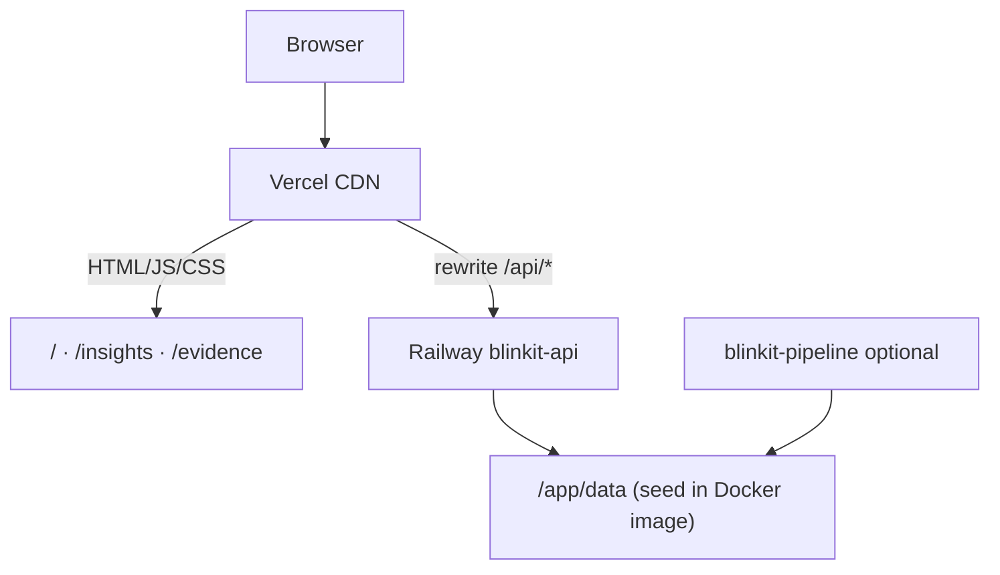

# Deployment Playbook — Railway (Backend) + Vercel (Frontend)

> **Last updated:** 2026-07-27  
> **Status:** Production-ready — API + 3 dashboard pages live-wired  
> **Detailed guides:** [Backend](./deployment-plan-backend-railway.md) · [Frontend](./deployment-plan-frontend-vercel.md)

---

## Production URLs

| Service | URL | Platform |
|---------|-----|----------|
| **Dashboard** | `https://blinkit-end-to-end-project.vercel.app` | Vercel |
| **API (direct)** | `https://blinkit-production-877e.up.railway.app` | Railway |
| **API (via proxy)** | `https://blinkit-end-to-end-project.vercel.app/api/*` | Vercel → Railway |

Update this table when domains change, then sync `frontend/vercel.json` and Railway `CORS_ORIGINS`.

---

## Architecture



| Layer | Repo path | Platform | Config |
|-------|-----------|----------|--------|
| Frontend | `frontend/public/` | Vercel | `frontend/vercel.json` |
| Backend API | `src/api/main.py` | Railway | `railway.toml`, `railway.json` |
| Seed data | `deploy/seed/` | Baked into Docker `api` image | `Dockerfile` |
| Pipeline worker | `scripts/run_pipeline.py` | Railway (optional) | `deploy/railway.pipeline.toml` |

**Deploy order:** Railway API first → update `vercel.json` proxy → Vercel frontend.

---

## Prerequisites

| Requirement | Backend | Frontend |
|-------------|---------|----------|
| GitHub repo pushed | Yes | Yes |
| Platform account | [railway.app](https://railway.app) | [vercel.com](https://vercel.com) |
| CLI (optional) | `.tools/railway.exe` or `npm i -g @railway/cli` | `npm i -g vercel` |
| Auth token (CI) | `RAILWAY_TOKEN` | `VERCEL_TOKEN` |
| Seed files present | `deploy/seed/insights/*.json` | — |
| Node.js 20.x (local) | — | For `npm run dev` / build |

---

## Quick deploy (CLI)

### 1. Backend — Railway (~5 min)

From repo root (PowerShell):

```powershell
# One-time: download Railway CLI to .tools/railway.exe, or npm i -g @railway/cli
# One-time: railway login   OR   $env:RAILWAY_TOKEN="<token>"

.\scripts\deploy_railway.ps1
```

The script:
- Validates seed files under `deploy/seed/`
- Links or creates `blinkit-api` project
- Sets env vars (`BLINKIT_DATA_DIR`, `INSIGHTS_RUN_ID`, `CORS_ORIGINS`, …)
- Runs `railway up --detach` (Docker target `api`)

**After deploy:**

```powershell
.\.tools\railway.exe domain          # copy public URL
curl https://blinkit-production-877e.up.railway.app/health
curl https://blinkit-production-877e.up.railway.app/api/overview
```

Expected: `{"status":"ok"}` and `insight_count: 117`.

### 2. Frontend — Vercel (~3 min)

Update proxy if Railway domain changed — edit `frontend/vercel.json`:

```json
"destination": "https://<your-railway-domain>/api/:path*"
```

Then deploy:

```powershell
# One-time: vercel login   OR   $env:VERCEL_TOKEN="<token>"

.\scripts\deploy_vercel.ps1
```

Or push to `main` — Vercel auto-deploys when the project is linked.

**Vercel project settings (first import):**

| Setting | Value |
|---------|-------|
| Root Directory | `frontend` |
| Framework | Other |
| Build Command | `npm run build` |
| Output Directory | `public` |
| Node.js | 20.x |

---

## First-time setup (Dashboard UI)

Use this when setting up from scratch without CLI scripts.

### Step A — Railway backend

1. [railway.app](https://railway.app) → **New Project** → **Deploy from GitHub** → select **Blinkit**
2. Rename service to **`blinkit-api`**
3. Confirm build settings read from repo:
   - `railway.toml` → builder `dockerfile`, target `api`
   - If build fails with Railpack: Railway → Settings → Build → **Dockerfile**
4. **Environment variables** (Settings → Variables):

   ```env
   BLINKIT_DATA_DIR=/app/data
   INSIGHTS_RUN_ID=run_phase4_final
   CORS_ORIGINS=https://blinkit-end-to-end-project.vercel.app,http://localhost:3000
   LOG_LEVEL=INFO
   ENABLE_OPENAPI=false
   ```

5. **Networking** → Generate Domain → note URL (e.g. `blinkit-production-877e.up.railway.app`)
6. Deploy. Seed data is included in the Docker image from `deploy/seed/` — no volume required for first deploy.

**Optional volume** (for pipeline updates without rebuild):

- Volumes → Add → mount `/app/data` (1 GB)
- Pipeline worker writes new insight JSON; flip `INSIGHTS_RUN_ID` on API service

### Step B — Vercel frontend

#### Where to set Root Directory (easy to miss)

Vercel defaults to the **repo root** (`./`). Your app lives in **`frontend/`**, so you must change this before the first deploy.

**During first import** ([vercel.com/new](https://vercel.com/new)):

1. Select your **Blinkit** GitHub repo
2. On the **Configure Project** screen, find the **Root Directory** row (below the project name)
3. Click **Edit** (or **Configure**) next to Root Directory — it often shows `./` by default
4. In the folder picker, select **`frontend`** → click **Continue** or **Save**
5. Confirm these build settings (should auto-detect after picking `frontend`):

   | Setting | Value |
   |---------|-------|
   | Framework Preset | **Other** |
   | Root Directory | **`frontend`** |
   | Build Command | `npm run build` |
   | Output Directory | **`public`** |
   | Install Command | `npm install` |

> If you don't see Root Directory: expand **Build and Output Settings** on the Configure Project page, or use the CLI workaround below.

**If the project already exists** (wrong root / build fails):

1. [vercel.com/dashboard](https://vercel.com/dashboard) → open your project
2. **Settings** → **General**
3. Scroll to **Root Directory** → **Edit**
4. Enter **`frontend`** → **Save**
5. **Deployments** → ⋮ on latest → **Redeploy**

**CLI workaround** (no dashboard root picker needed):

```powershell
cd e:\Blinkit\frontend
npm i -g vercel
vercel login
vercel link          # link to new or existing project
vercel deploy --prod
```

Or from repo root: `.\scripts\deploy_vercel.ps1`

---

1. [vercel.com/new](https://vercel.com/new) → Import **Blinkit** repo → Root Directory = **`frontend`**
2. Environment variables:

   | Variable | Production value |
   |----------|------------------|
   | `RAILWAY_API_URL` | *(empty — use proxy)* |
   | `INSIGHTS_RUN_ID` | `run_phase4_final` |

4. Edit `frontend/vercel.json` — set `/api/:path*` destination to your Railway domain
5. Deploy → note production URL (e.g. `blinkit-end-to-end-project.vercel.app`)
6. Add Vercel URL to Railway `CORS_ORIGINS` if using direct API calls (not needed with proxy)

---

## Environment variables

### Railway — `blinkit-api`

| Variable | Value | Required |
|----------|-------|----------|
| `PORT` | *(Railway auto)* | Yes |
| `BLINKIT_DATA_DIR` | `/app/data` | Yes |
| `INSIGHTS_RUN_ID` | `run_phase4_final` | Yes |
| `CORS_ORIGINS` | Vercel URL + `http://localhost:3000` | Yes |
| `LOG_LEVEL` | `INFO` | No |
| `ENABLE_OPENAPI` | `false` | No |

**Never on API service:** `GROQ_API_KEY`, ingestion tokens.

### Vercel — `frontend`

| Variable | Recommended | Notes |
|----------|-------------|-------|
| `RAILWAY_API_URL` | *(empty)* | Browser uses same-origin `/api/*` proxy |
| `INSIGHTS_RUN_ID` | `run_phase4_final` | Injected into `config.js` |

### Railway — `blinkit-pipeline` (optional)

| Variable | Value |
|----------|-------|
| `GROQ_API_KEY` | Secret |
| `BLINKIT_DATA_DIR` | `/app/data` |
| Docker target | `pipeline` via `deploy/railway.pipeline.toml` |

---

## Redeploy procedures

### Backend code change

```powershell
.\scripts\deploy_railway.ps1
# or: git push → Railway auto-deploy (if GitHub linked)
```

### Backend data refresh (new insight run)

1. Run pipeline on `blinkit-pipeline` service (or locally)
2. Copy new JSON to volume or update `deploy/seed/` and rebuild
3. Set `INSIGHTS_RUN_ID=<new_run_id>` on `blinkit-api`
4. Redeploy API (env-only change is enough)

### Frontend change

```powershell
.\scripts\deploy_vercel.ps1
# or: git push to main → Vercel auto-deploy
```

### Railway domain changed

1. Update `frontend/vercel.json` → `/api/:path*` destination
2. Redeploy Vercel
3. Update Railway `CORS_ORIGINS` if using direct API strategy

---

## Production smoke test

Run after every deploy:

| # | Check | Command / URL | Pass |
|---|-------|---------------|------|
| 1 | Health | `curl https://<railway>/health` | `{"status":"ok"}` |
| 2 | Overview data | `curl https://<railway>/api/overview` | `insight_count: 117` |
| 3 | Dashboard KPIs | Open `https://<vercel>/` | Shows 117, not mock "1.2M" |
| 4 | Explorer | `https://<vercel>/insights` | Cards load, filters work |
| 5 | Evidence | Click card → `/evidence?id=...` | 3 paraphrased snippets |
| 6 | Proxy | `curl https://<vercel>/api/overview` | Same JSON as Railway direct |

PowerShell one-liner (adjust URLs):

```powershell
$r="https://blinkit-production-877e.up.railway.app"
$v="https://blinkit-end-to-end-project.vercel.app"
(Invoke-RestMethod "$r/health").status
(Invoke-RestMethod "$r/api/overview").insight_count
(Invoke-RestMethod "$v/api/overview").insight_count
```

---

## Rollback

| Platform | Steps |
|----------|-------|
| **Railway** | Deployments → select previous → Rollback. Or set `INSIGHTS_RUN_ID` to prior run. |
| **Vercel** | Deployments → previous → **Promote to Production** (instant). |

---

## Troubleshooting

| Symptom | Likely cause | Fix |
|---------|--------------|-----|
| KPIs show "—" on Vercel | API down or bad proxy URL | Check Railway health; fix `vercel.json` |
| CORS error in browser | Direct API without CORS | Use empty `RAILWAY_API_URL` (proxy) or add Vercel URL to `CORS_ORIGINS` |
| `/health` OK, `/api/overview` 500 | Missing data files | Verify `deploy/seed/` in image; check `BLINKIT_DATA_DIR` |
| `insight_count: 0` | Wrong run ID | `INSIGHTS_RUN_ID` must match `insights_<id>.json` filename |
| Railpack build error | Wrong builder | Set Builder = Dockerfile; ensure `railway.json` in repo |
| 404 on `/insights` | Bad rewrites | Root dir = `frontend`, output = `public` |
| Can't find Root Directory in Vercel | Hidden on import screen | Settings → General → Root Directory → `frontend`; or use CLI from `frontend/` |
| **`frontend` folder missing in Vercel picker** | **`frontend/` not pushed to GitHub** | Push `frontend/` to GitHub (see below), then refresh import |
| Build looks for Python/Dockerfile | Root still repo root | Set Root Directory to `frontend`, redeploy |
| **Railway healthcheck failure** | Docker built `pipeline` stage (exits immediately) | Redeploy after Dockerfile fix; Railway → Build → Docker target **`api`** |
| `config.js` has `__API_URL__` | Build skipped | Run `npm run build` in `frontend/` |

Full troubleshooting: [Backend §12](./deployment-plan-backend-railway.md#12-troubleshooting) · [Frontend §13](./deployment-plan-frontend-vercel.md#13-troubleshooting)

---

## Local dev (pre-deploy verify)

**Terminal 1 — API:**

```powershell
cd e:\Blinkit
$env:PYTHONPATH="src"
$env:BLINKIT_DATA_DIR="data"
$env:INSIGHTS_RUN_ID="run_phase4_final"
$env:CORS_ORIGINS="http://localhost:3000"
uvicorn api.main:app --reload --port 8000
```

**Terminal 2 — Frontend:**

```powershell
cd e:\Blinkit\frontend
npm install
npm run dev
# → http://localhost:3000
```

**Tests:**

```powershell
pytest tests/test_api.py -v
```

---

## Cost estimate (MVP)

| Resource | ~Monthly |
|----------|----------|
| Railway API (512 MB–1 GB) | $5 |
| Railway volume (optional) | $0.25 |
| Pipeline (on demand) | $1–5/run |
| Vercel Hobby | $0 |
| **Total** | **~$5–10/mo** |

---

## Related docs

- [deployment-plan.md](./deployment-plan.md) — summary index
- [deployment-plan-backend-railway.md](./deployment-plan-backend-railway.md) — API endpoints, pipeline worker
- [deployment-plan-frontend-vercel.md](./deployment-plan-frontend-vercel.md) — page wiring, Stitch re-sync
- [architecture.md](./architecture.md)
- [implementation-plan.md](./implementation-plan.md) — Phase 6

---

*Playbook v1.0 — CLI scripts, production URLs, seed-in-Docker default*
