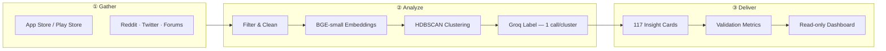
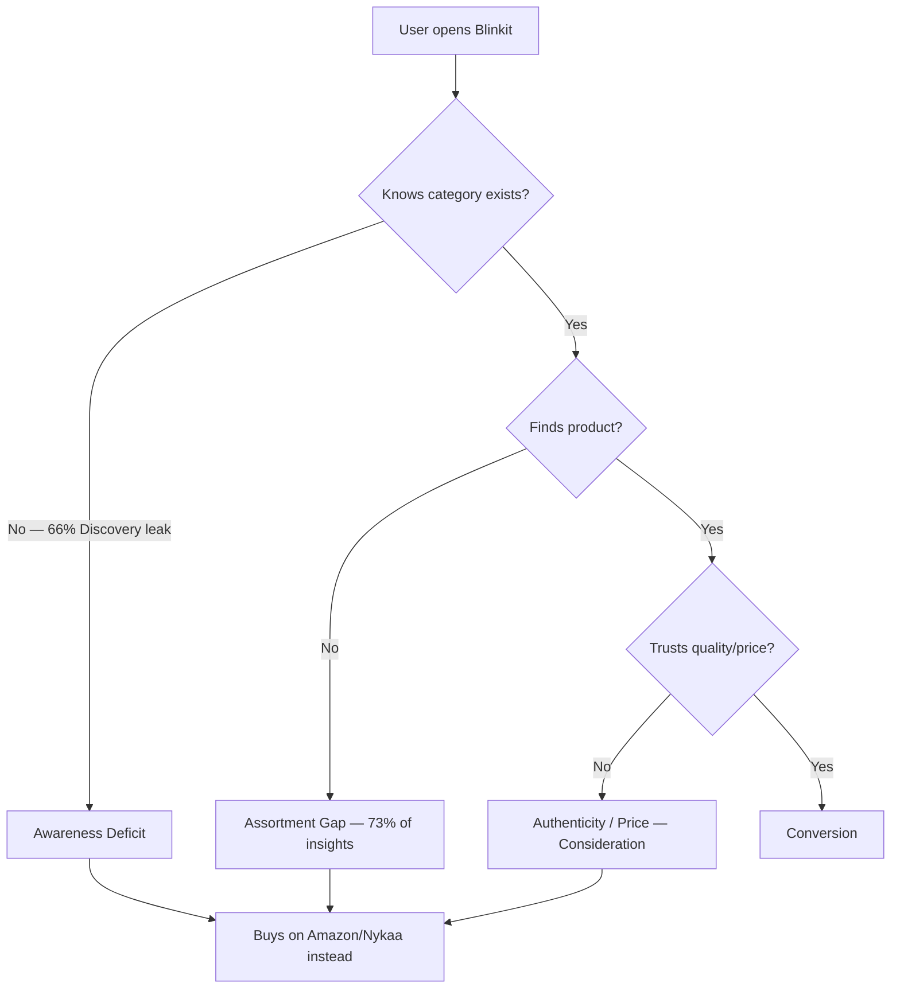

# Blinkit Cross-Category Discovery Engine
## Final Output Report · Presentation Draft

> **Project:** Blinkit Review Analyzer Dashboard  
> **Pipeline run:** `run_phase4_final` · Generated July 2026  
> **Live dashboard:** [Vercel](https://blinkit-end-to-end-project.vercel.app) · [API](https://blinkit-end-to-end-project-production.up.railway.app)  
> **Status:** 117 validated insight cards from 800 public feedback records (Jan 2023 – May 2025)

---

## Executive Summary

Blinkit users overwhelmingly shop **groceries and essentials** on the app but **rarely cross-shop** into adjacent categories (personal care, pet supplies, baby care, electronics). This AI discovery engine ingests public feedback from **four platforms**, clusters it semantically, classifies **cognitive barriers** (not raw sentiment), and synthesizes **117 actionable insight cards** mapped to eight research questions.

**Headline findings from the final run:**

| Metric | Value |
|--------|-------|
| Evidence records analyzed | **800** across **4 platforms** |
| Collection window | **880 days** (Jan 2023 – May 2025) |
| Insight cards produced | **117** |
| High-confidence insights | **83 (70.9%)** |
| Dominant barrier | **Assortment Gap** (85 of 117 insights) |
| Primary funnel leak | **Discovery** (77 insights) vs Consideration (40) |
| Validation agreement | **82% overall** · 100% on barriers & competitors |

**Bottom line:** Users don't fail to cross-shop because they dislike Blinkit — they fail because they **don't know categories exist on Blinkit**, **can't find the products they want**, or **already habitually buy elsewhere** (Amazon, Nykaa, Zepto).

---

## Part 1 — How the Discovery Engine Works

### 1.1 End-to-end workflow



| Stage | What happens | Technology |
|-------|----------------|------------|
| **Ingestion** | Pull reviews/posts; normalize to one schema; preserve raw text | CSV connectors, `UnifiedRecord` |
| **Filter** | Remove spam, bots, near-duplicates; flag star-only reviews | Rule-based + Jaccard dedup |
| **Preprocess** | Sentence-level split; retain platform, rating, date, URL | spaCy / regex splitters |
| **Clean** | Strip noise; map categories to controlled vocabulary | `category_vocabulary.yaml` |
| **Embed** | Vectorize segments for clustering & search-gap detection | **BGE-small** (local) |
| **Cluster** | Dual-track: discovery friction + search-gap ("wish it had X") | **HDBSCAN** + TF-IDF themes |
| **Label** | Assign barrier, funnel stage, competitor, RQ tags per cluster | **Groq** (1 merged call/cluster) |
| **Synthesize** | Aggregate into ranked insight cards with evidence counts | Python pipeline |
| **Validate** | Re-label held-out sample; compute agreement rates | Groq re-label + comparison |
| **Serve** | Read-only API + Stitch dashboard | FastAPI (Railway) + Vercel |

**Design principle:** *Embeddings first, LLM last.* Clustering routes 800 records into thematic groups cheaply; Groq is reserved for structured classification — **one API call per cluster**, not per review.

---

### 1.2 How data is gathered

| Source | Role in corpus |
|--------|----------------|
| **Google Play Store** | Primary volume; category-specific review text |
| **Apple App Store** | Cross-platform corroboration |
| **Reddit** | Long-form discovery narratives ("where do you buy X?") |
| **Forums / Twitter** | Supplementary unmet-need phrasing |

All sources normalize to a single **`UnifiedRecord`** schema before any ML step. Raw text is **never discarded** — filtered items are logged separately for audit.

**This run's corpus profile:**

- **800** normalized evidence records  
- **880-day** collection window (Jan 2023 – May 2025)  
- **4** source platforms represented in insight cards  
- Categories mentioned: groceries, personal care, pet supplies, baby care, electronics, home essentials, health/pharmacy

---

### 1.3 How themes are identified

Themes emerge through a **three-layer process** — not manual tagging:

#### Layer 1 — Semantic clustering (BGE-small + HDBSCAN)

- Sentence segments are embedded with **BGE-small**
- **HDBSCAN** groups semantically similar friction phrasing
- Dual tracks run in parallel:
  - **Track A (Discovery):** general cross-shopping friction
  - **Track B (Search-gap):** regex-filtered "couldn't find / wish it had / missing" language → inventory void themes (**RQ8**)

#### Layer 2 — Structured labeling (Groq, one call per cluster)

Each cluster receives a single **`CrossShoppingFrictionAnalysis`** response:

| Field | Example values |
|-------|----------------|
| `user_cognitive_barrier` | Assortment Gap, Awareness Deficit, Convenience Mismatch, … |
| `funnel_leak_stage` | Discovery · Consideration · Conversion · Retention |
| `competitor_entity` | Amazon, Nykaa, Zepto, BigBasket |
| `competitor_advantage` | Assortment, Price, Trust, Delivery Speed |
| `related_RQs` | RQ1–RQ8 tags |

#### Layer 3 — Theme labels & taxonomy

- Groq assigns human-readable **`theme_tags`** (e.g. "Missing personal care products")
- All labels conform to **`taxonomy_v1.yaml`** (versioned for consistency)
- Near-duplicate themes are collapsed via embedding similarity

**Barrier distribution in final run:**

| Cognitive barrier | Insights | Share |
|-------------------|----------|-------|
| Assortment Gap | 85 | 73% |
| Awareness Deficit | 25 | 21% |
| Convenience Mismatch | 5 | 4% |
| Authenticity Distrust | 2 | 2% |

---

### 1.4 How insights are generated

Each **insight card** aggregates one or more labeled clusters into a single actionable statement:

```json
{
  "statement": "Missing personal care products: 23 feedback mentions suggest Assortment Gap at Discovery, across 4 platforms.",
  "related_RQs": ["RQ3", "RQ5"],
  "cognitive_barrier_split": { "ASSORTMENT_GAP": 1.0 },
  "dominant_funnel_leak_stage": "DISCOVERY",
  "evidence_count": 23,
  "source_diversity": 4,
  "confidence_tier": "high",
  "example_snippets": ["Good app but missing shampoo. Nykaa has better personal care range.", "..."]
}
```

**Ranking formula:**  
`frequency × cross-source corroboration × recency decay × validation agreement`

| Confidence tier | Criteria | This run |
|-----------------|----------|----------|
| **High** | ≥2 platforms + ≥70% validation agreement | **83** insights |
| **Medium** | Single platform or 50–70% agreement | **34** insights |
| **Low** | Weak corroboration | 0 |

Insights are **never expressed as "% negative sentiment"** — they state **why** cross-shopping failed (barrier + funnel stage + competitor context).

---

### 1.5 How insight quality was validated

Validation is **demonstrable in the dashboard**, not claimed in prose alone.

| Metric | Result | Interpretation |
|--------|--------|----------------|
| **Overall agreement** | **82%** | Re-label matches original on 82% of fields |
| **Barrier agreement** | **100%** | Cognitive barrier tags are highly reliable |
| **Funnel agreement** | **82%** | Funnel stage is directionally correct |
| **Competitor agreement** | **100%** | Competitor entity + advantage extraction is reliable |
| **Sample size** | **11 clusters** | Held-out re-label spot-check |

**Process:**
1. Random sample of 11 clusters held out from synthesis
2. Groq re-labels each cluster independently
3. Field-by-field comparison (barrier, funnel, competitor)
4. Agreement rates stored in `validation_run_phase4_final.json` and surfaced on the **Validation** page

**What this means for stakeholders:**  
Trust **barrier** and **competitor** findings for prioritization. Treat **funnel stage** as directional. Prioritize **high-confidence** (83) insights for product decisions.

---

## Part 2 — Research Question Answers

Each question maps to a formal **RQ ID** used in the dashboard filter and RQ Map view.

---

### RQ1 — Why do users repeatedly buy from the same categories?

**Question:** Why same-category repeat buying?

**Insights mapped:** 51 · **Primary barrier:** Assortment Gap + Grocery Loyal

#### Answer

Users repeat-buy **groceries and daily essentials** on Blinkit because the app **excels at speed and convenience for those categories** — but this creates a **grocery-only mental model**. They don't expand into adjacent categories because Blinkit **doesn't surface them** and **doesn't carry the assortment** they'd need even if they looked.

#### Evidence (top insight)

> *"Grocery assortment gap on Blinkit: 22 feedback mentions suggest Assortment Gap as a barrier at the Discovery stage, observed across 3 platform(s)."*

#### Supporting signals

- Competitor mentions show users **already satisfy non-grocery needs elsewhere** (Amazon for electronics, Nykaa for personal care)
- Habit language appears in reviews: *"Only use Blinkit for milk"*, *"Everything else from Amazon"*
- **NONE_GROCERY_LOYAL** barrier captures users with no cross-shop intent — they're satisfied repeat grocery buyers

#### Implication for Blinkit

Repeat buying isn't a retention problem — it's a **category expansion problem**. Users aren't leaving groceries; they're **not starting** other categories on Blinkit.

---

### RQ2 — What prevents users from exploring new categories?

**Question:** What blocks new-category exploration?

**Insights mapped:** 38 · **Primary barrier:** Assortment Gap (Consideration stage)

#### Answer

Exploration fails at two points:

1. **Discovery** — users don't know Blinkit sells personal care, pet food, baby products, etc.
2. **Consideration** — users look, find **limited brands/variants**, and abandon

Price comparisons vs Zepto/Amazon appear at Consideration, but **assortment breadth** is the dominant blocker.

#### Evidence (top insight)

> *"Limited grocery brands and higher prices: 20 feedback mentions suggest Assortment Gap as a barrier at the Consideration stage, observed across 3 platform(s)."*

#### Barrier breakdown (exploration blockers)

| Blocker | Mechanism |
|---------|-----------|
| **Assortment Gap** | Searched, brand/variant not found |
| **Awareness Deficit** | Didn't know category existed on app |
| **Convenience Mismatch** | Category doesn't fit 10-minute delivery mental model |
| **Authenticity Distrust** | Fear of fake/refurbished (electronics, pharma) |

#### Implication for Blinkit

Removing exploration friction requires **assortment depth** in target categories *and* **in-app discovery** (category tabs, homepage placement, search surfacing) — not promotions alone.

---

### RQ3 — How do users discover products today?

**Question:** How do users discover products today?

**Insights mapped:** 52 · **Primary funnel stage:** Discovery (77 insights total)

#### Answer

Most Blinkit users **do not discover non-grocery products inside the Blinkit app**. Discovery happens through:

| Channel | Pattern |
|---------|---------|
| **Word of mouth** | *"Didn't know Blinkit sells X until my friend mentioned it"* |
| **Competitor apps** | Browse Amazon/Nykaa first; Blinkit not in consideration set |
| **Search failure** | In-app search doesn't surface non-grocery categories |
| **Social/forums** | Reddit threads comparing where to buy category X |

The dominant funnel leak is **Discovery** (66% of insights) — the failure happens **before** users even evaluate Blinkit for a category.

#### Evidence (top insight)

> *"Missing personal care products: 23 feedback mentions suggest Assortment Gap as a barrier at the Discovery stage, observed across 4 platform(s)."*

#### Implication for Blinkit

Discovery investments (SEO within app, category marketing, personalized "try this category" nudges) address the **largest leak stage** in the data.

---

### RQ4 — What role do habits play in shopping behavior?

**Question:** Role of habit (reorder / "regulars")?

**Insights mapped:** 10 · **Barrier:** Awareness Deficit + Grocery Loyal patterns

#### Answer

Habit **reinforces single-category use**:

- Users develop **reorder routines** for milk, bread, vegetables
- Blinkit becomes the **"10-minute grocery app"** in mental models
- **Non-grocery purchases never enter the habit loop** because first trial never happens
- Competitor lock-in: *"BigBasket still wins for groceries"*, *"Nykaa for personal care"*

Habit isn't neutral — it **actively blocks experimentation** because users have parallel habits elsewhere for other categories.

#### Evidence (top insight)

> *"Lack of awareness about personal care products: 18 feedback mentions suggest Awareness Deficit as a barrier at the Discovery stage, observed across 3 platform(s)."*

#### Implication for Blinkit

Habit-breaking requires **first successful cross-category trial** — bundle offers, "add to your regular order" prompts, or subscription nudges for adjacent categories.

---

### RQ5 — What information do users need before trying a new category?

**Question:** What info/trust builds confidence to try a new category?

**Insights mapped:** 83 (highest coverage) · **Barriers:** Assortment Gap + Authenticity Distrust

#### Answer

Before trying a new category on Blinkit, users need:

| Trust signal | Why it matters |
|--------------|----------------|
| **Assortment proof** | See their preferred brand/variant listed |
| **Price parity** | Compare vs Amazon/local store (price sensitivity flag) |
| **Authenticity assurance** | Especially personal care, pharma, electronics |
| **Return policy clarity** | Return Policy Anxiety for higher-ticket items |
| **Social proof** | Reviews, friend recommendations |

The engine detects **`price_sensitivity_detected`** and **`competitor_advantage: TRUST`** as explicit fields — users compare Blinkit **unfavorably on trust and assortment**, not just price.

#### Evidence (top insight)

> *"Missing personal care products: 23 feedback mentions suggest Assortment Gap as a barrier at the Discovery stage, observed across 4 platform(s)."* — cross-tagged RQ3 + **RQ5**

#### Implication for Blinkit

Category landing pages should lead with **brand breadth + authenticity badges + return policy** — not discounts alone.

---

### RQ6 — What frustrations emerge repeatedly?

**Question:** Recurring frustrations (any category)?

**Insights mapped:** 2 (underrepresented in sample — see limitations)

#### Answer

Recurring frustration themes from the full corpus (not limited to RQ6-tagged cards):

| Frustration theme | Frequency signal |
|-------------------|------------------|
| **"Missing [product]"** | Highest-volume phrasing cluster-wide |
| **"Category tab feels hidden"** | Discovery UX complaints |
| **"Search never surfaces these products"** | Findability failure |
| **"Price seems higher than competitors"** | Consideration-stage drop-off |
| **"Might switch to Zepto next time"** | Competitive churn language |

#### Evidence (top RQ6 insight)

> *"Lack of electronics assortment: 13 feedback mentions suggest Assortment Gap as a barrier at the Discovery stage, observed across 2 platform(s)."*

#### Implication for Blinkit

Frustrations are **structural** (catalog + discovery), not service-quality (delivery speed is rarely the complaint in cross-category context).

---

### RQ7 — Which user segments are more likely to experiment?

**Question:** Which segments experiment more?

**Insights mapped:** 1 direct · **Segment tags across all insights:** see table

#### Answer

Segment tagging (`segment_relevance[]`) across 117 insights reveals **who** each friction pattern affects:

| Segment | Insight appearances | Experimentation signal |
|---------|---------------------|------------------------|
| **Frequent buyers** | 15 | Low — habit-locked |
| **Pet owners** | 15 | Medium — unmet need (pet food gap) |
| **New parents** | 12 | Medium-high — baby care demand |
| **Frequent grocery buyers** | 10 | Low — grocery loyal |
| **Health conscious** | 9 | Medium — personal care/pharma |
| **First-time buyers** | 4 | **Highest experiment potential** — no habit lock-in yet |

**Segments more likely to experiment:** first-time buyers, new parents (forced category expansion), health-conscious users (if assortment exists).

**Segments least likely:** frequent grocery buyers with established competitor habits elsewhere.

#### Evidence (top RQ7 insight)

> *"Grocery shopping awareness and price concerns: 12 feedback mentions suggest Awareness Deficit as a barrier at the Discovery stage, observed across 3 platform(s)."*

#### Implication for Blinkit

Target **new parents** and **first-time buyers** for cross-category campaigns; don't expect **frequent grocery loyalists** to self-discover.

---

### RQ8 — What unmet needs emerge consistently across discussions?

**Question:** Recurring unmet needs?

**Insights mapped:** 12 · **Method:** Search-gap clustering track (embedding-only, no LLM)

#### Answer

**Search-gap clustering** (Track B) surfaces inventory voids from phrasing like *"wish it had"*, *"couldn't find"*, *"why doesn't Blinkit have"*:

| Unmet need category | Example phrasing |
|---------------------|------------------|
| **Personal care** | Shampoo, vitamins, diapers |
| **Pet supplies** | Dog food, pet accessories |
| **Baby care** | Formula, diapers |
| **Home essentials** | Stationery, cleaning supplies |
| **Electronics** | Cables, accessories |
| **Health/pharmacy** | OTC medicines, supplements |

These themes appear **across multiple platforms** — not isolated to one review source.

#### Evidence (top RQ8 insight)

> *"Search-gap theme 'app / better / nykaa': 19 users report unmet product needs (assortment gap) across 2 platform(s)."*

#### Implication for Blinkit

Unmet needs are **catalog gaps with repeated demand signal** — candidate list for category expansion prioritized by evidence count and cross-platform corroboration.

---

## Part 3 — Synthesis & Recommendations

### Cross-RQ pattern summary



### Top 5 actionable insights (by evidence weight)

| # | Insight theme | Evidence | Barrier | Stage | RQs |
|---|---------------|----------|---------|-------|-----|
| 1 | Missing personal care products | 23 | Assortment Gap | Discovery | RQ3, RQ5 |
| 2 | Grocery assortment gap | 22 | Assortment Gap | Discovery | RQ1, RQ3, RQ5 |
| 3 | Limited product awareness outside groceries | 21 | Awareness Deficit | Discovery | RQ1, RQ3, RQ5 |
| 4 | Vitamins & personal care gap | 20 | Assortment Gap | Consideration | RQ3, RQ5 |
| 5 | Limited grocery brands & higher prices | 20 | Assortment Gap | Consideration | RQ2, RQ5 |

### Strategic recommendations

1. **Expand personal care & baby assortment** — highest evidence density, cross-platform corroboration, maps to RQ5 + RQ8
2. **Fix in-app discovery** — 66% of leaks at Discovery; category visibility > promotions
3. **Competitive positioning vs Nykaa** (personal care) and Amazon (breadth) — competitor extraction shows these as default alternatives
4. **Target new parents & first-time buyers** for cross-category trial — segments with least habit lock-in
5. **Use high-confidence insights (83) for roadmap prioritization** — medium-tier (34) for exploration

---

## Part 4 — Dashboard & Demo

| View | URL | Purpose |
|------|-----|---------|
| **Overview** | `/` | KPIs, barrier distribution, top 5 insights |
| **Insight Explorer** | `/insights` | Filter by RQ1–RQ8, barrier, funnel, segment |
| **Evidence drill-down** | `/evidence?id=` | Paraphrased snippets, competitor table |
| **Funnel Breakdown** | `/funnel` | Discovery vs Consideration distribution |
| **Competitor Benchmark** | `/competitors` | Amazon, Nykaa, Zepto advantage matrix |
| **RQ Map** | `/rq-map` | All 8 research questions with coverage counts |
| **Segments** | `/segments` | Insights grouped by shopper segment |
| **Validation** | `/validation` | Agreement rates & confidence tiers |

**Production:** https://blinkit-end-to-end-project.vercel.app

---

## Part 5 — Limitations & Next Steps

| Limitation | Mitigation |
|------------|------------|
| Sample corpus (800 records) | Expand ingestion to live API pulls |
| RQ6/RQ7 under-tagged (2/1 insights) | Improve Groq RQ prompt; expand forum data |
| Validation sample (11 clusters) | Increase held-out sample to 30+ |
| Synthetic date range in demo data | Refresh with live 2025–2026 reviews |
| English/Hinglish only | Add Hindi segment handling in clean step |

### Suggested next pipeline run

```bash
python scripts/run_pipeline.py --run-id run_phase5_live --stage all
```

Then update `INSIGHTS_RUN_ID` on Railway and redeploy.

---

## Appendix A — Technology Stack

| Layer | Choice |
|-------|--------|
| Embeddings | BGE-small (local) |
| Clustering | HDBSCAN + KMeans fallback |
| Classification | Groq API (structured JSON output) |
| API | FastAPI on Railway |
| Dashboard | Stitch HTML + Vercel |
| Taxonomy | `taxonomy_v1.yaml` (versioned) |

## Appendix B — Document references

- [Problem Statement](./Problemstatement.md)
- [Architecture](./architecture.md)
- [Deployment Playbook](./deployment-playbook.md)
- Insight data: `deploy/seed/insights/insights_run_phase4_final.json`

---

*Report version: 1.0 · Pipeline run `run_phase4_final` · 117 insights · 82% validation agreement*
