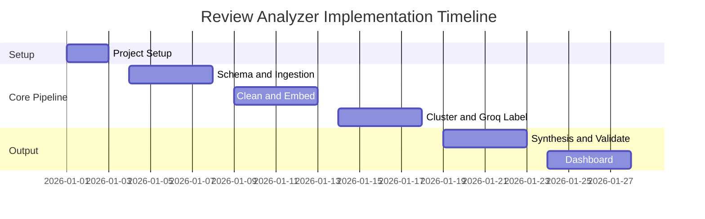
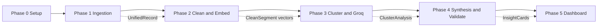

# Phase-Wise Implementation Plan

> **References:** [Problemstatement.md](./Problemstatement.md) · [architecture.md](./architecture.md)  
> **Project:** Blinkit Review Analyzer Dashboard  
> **Timeline:** 5 weeks · Batch pipeline · Review analyzer dashboard (validated insights)

---

## Table of Contents

1. [Executive Summary](#1-executive-summary)
2. [Phase Overview & Dependencies](#2-phase-overview--dependencies)
3. [Phase 0 — Project Setup & Foundations](#3-phase-0--project-setup--foundations)
4. [Phase 1 — Schema & Ingestion](#4-phase-1--schema--ingestion)
5. [Phase 2 — Clean & Embed](#5-phase-2--clean--embed)
6. [Phase 3 — Cluster & Groq Label](#6-phase-3--cluster--groq-label)
7. [Phase 4 — Synthesis & Validation](#7-phase-4--synthesis--validation)
8. [Phase 5 — Dashboard](#8-phase-5--dashboard)
9. [Cross-Phase Requirements Matrix](#9-cross-phase-requirements-matrix)
10. [Testing Strategy by Phase](#10-testing-strategy-by-phase)
11. [Risk Register & Mitigations](#11-risk-register--mitigations)
12. [Definition of Done](#12-definition-of-done)

---

## 1. Executive Summary

This plan implements the fixed 12-stage pipeline and **review analyzer dashboard** in five delivery phases, plus a setup phase:

| Phase | Focus | Duration | Pipeline Stages Covered |
|-------|-------|----------|-------------------------|
| **0** | Setup, repo, config, secrets | 2–3 days | — |
| **1** | Schema & ingestion | Week 1 | Pre-pipeline (sources → raw store) |
| **2** | Clean & embed | Week 2 | Stages 1–4 (Filter → Embed) |
| **3** | Cluster & Groq label | Week 3 | Stages 5–9 (Friction, Funnel, Competitor, Search-Gap, Theme) |
| **4** | Synthesis & validation | Week 4 | Stages 10–11 (Insight cards, Validate) |
| **5** | Dashboard | Week 5 | Stage 12 — **review analyzer dashboard** (primary deliverable) |

### Non-Negotiable Constraints (carry through every phase)

- **BGE-small** for all embeddings; **Groq** for classification/synthesis only
- **One Groq call per cluster** — `CrossShoppingFrictionAnalysis` returns all friction fields in a single response
- **Sentence-level** chunking before embedding (never full-review)
- **Never discard raw text** — filter/tag and log exclusions
- **Dashboard never shows plain "% negative"** — only cognitive barriers and funnel stages
- **Every insight maps to ≥1 RQ** (RQ1–RQ8)

---

## 2. Phase Overview & Dependencies



> **Export for report:** If preview still fails, open [gantt-timeline.html](./gantt-timeline.html) in a browser, or paste [gantt-timeline.mmd](./gantt-timeline.mmd) into [Mermaid Live Editor](https://mermaid.live) and export as PNG/SVG.

### Dependency Graph



| Phase | Depends On | Unblocks |
|-------|------------|----------|
| 0 | — | All phases |
| 1 | Phase 0 | Phases 2–5 |
| 2 | Phase 1 (raw records) | Phases 3–5 |
| 3 | Phase 2 (embeddings, clean segments) | Phases 4–5 |
| 4 | Phase 3 (cluster analyses) | Phase 5 |
| 5 | Phase 4 (insight cards + validation) | Dashboard live |

---

## 3. Phase 0 — Project Setup & Foundations

**Duration:** 2–3 days  
**Goal:** Bootstrapped repo, tooling, and configuration so Phase 1 can start immediately.

### 3.1 Tasks

#### Repository & Tooling

- [ ] Initialize project structure per [architecture.md §14](./architecture.md#14-directory-structure)
- [ ] Create `pyproject.toml` with dependencies:
  - `pydantic>=2.0`, `typer`, `python-dotenv`
  - `sentence-transformers`, `chromadb` (or `faiss-cpu`)
  - `hdbscan`, `scikit-learn`
  - `groq`, `fastapi`, `uvicorn`, `streamlit`
  - `spacy` or `pysbd`, `bleach`, `rapidfuzz`
  - `pytest`, `ruff`, `mypy` (optional)
- [ ] Add `Makefile` targets: `install`, `ingest`, `pipeline`, `dashboard`, `test`
- [ ] Create `.env.example` with `GROQ_API_KEY`, Reddit/Twitter placeholders
- [ ] Add `.gitignore` — exclude `.env`, `data/raw/*`, model caches, `__pycache__`

#### Configuration Files

- [ ] `config/settings.yaml` — model paths, batch sizes, cluster params
- [ ] `config/taxonomy_v1.yaml` — cognitive barriers, funnel stages (versioned)
- [ ] `config/category_vocabulary.yaml` — e.g. `"dog food"` → `pet_supplies`
- [ ] `config/competitor_aliases.yaml` — Amazon, Nykaa, Myntra, Zepto, Instamart

#### Data Directories

- [ ] `data/raw/` — immutable ingestion output (JSONL per run)
- [ ] `data/processed/` — segments, clusters, intermediate artifacts
- [ ] `data/insights/` — final insight card JSON

#### Logging & Run Tracking

- [ ] Implement `run_id` generator (UUID + timestamp)
- [ ] Structured logging: JSON logs with `run_id`, `stage`, `counts`
- [ ] `metadata_db` schema stub — `ingestion_runs`, `pipeline_runs` tables

### 3.2 Deliverables

| Deliverable | Location |
|-------------|----------|
| Bootstrapped repo | `blinkit-review-analyzer/` |
| Config + taxonomy v1 | `config/` |
| `.env.example` | Project root |
| Empty data dirs + gitkeep | `data/` |
| `make install` succeeds | — |

### 3.3 Exit Criteria

- [ ] `python -m pytest` runs (even if zero tests)
- [ ] All config YAML files validate against expected structure
- [ ] Secrets documented; no secrets in repo

### 3.4 Token / Cost Notes

No LLM or embedding calls in this phase.

---

## 4. Phase 1 — Schema & Ingestion

**Duration:** Week 1 (5 working days)  
**Goal:** Pull feedback from ≥3 sources, normalize to `UnifiedRecord`, persist immutably.  
**Pipeline stages:** Pre-pipeline (feeds Stage 1 Filter)

### 4.1 Objectives

- Define all core Pydantic contracts upfront
- Build connectors for Play Store, App Store, Reddit (minimum)
- Normalize heterogeneous input → single schema
- Preserve raw text verbatim; never discard

### 4.2 Detailed Task Breakdown

#### Day 1–2: Pydantic Models

- [ ] `UnifiedRecord` — `record_id`, `platform`, `raw_text`, `rating`, `created_at`, `url`, `ingestion_run_id`, `metadata`
- [ ] `FilteredRecord` — extends with `filter_status`, `filter_reason`
- [ ] `SentenceSegment` — post-preprocess shape
- [ ] `CleanSegment` — post-clean shape with tags
- [ ] `CrossShoppingFrictionAnalysis` — exact schema from problem statement
- [ ] `ClusterAnalysis` — friction + `theme_label` + `related_RQs[]` + `segment_relevance[]`
- [ ] `InsightCard` — full dashboard output contract
- [ ] Unit tests: schema validation, invalid enum rejection

#### Day 2–3: Storage — Raw Store

- [ ] `raw_store.py` — append-only JSONL writer per `ingestion_run_id`
- [ ] `record_id` = SHA-256(`platform` + `url` + `created_at`)
- [ ] Read-back utility for downstream pipeline
- [ ] Immutability: no updates/deletes on raw files

#### Day 3–4: Source Connectors

| Connector | Priority | Implementation |
|-----------|----------|----------------|
| `PlayStoreConnector` | P0 | Scraper library or CSV import; Blinkit app reviews |
| `AppStoreConnector` | P0 | RSS feed or export CSV |
| `RedditConnector` | P0 | PRAW keyword search: "Blinkit", "blinkit app", category terms |
| `TwitterConnector` | P1 | API v2 or manual CSV fallback |
| `ForumConnector` | P2 | Quora/manual CSV fallback |

- [ ] Each connector returns list of source-native dicts
- [ ] Rate-limit handling with exponential backoff
- [ ] Manual fallback: document CSV format in `docs/manual_corpus.md`

#### Day 4–5: Normalizer & CLI

- [ ] `normalizer.py` — map each connector output → `UnifiedRecord`
- [ ] Handle missing fields: Reddit `rating=None`, log in metadata
- [ ] CLI: `python -m pipeline ingest --source play_store --run-id <uuid>`
- [ ] CLI: `python -m pipeline ingest --source all` (batch all connectors)
- [ ] Ingestion summary report: count by platform, date range, null-rating %

### 4.3 Edge Cases (Phase 1)

| Edge Case | Handling in Phase 1 |
|-----------|---------------------|
| Missing metadata (Reddit) | `rating=None`; store platform in metadata |
| API rate limits | Retry + backoff; fallback to manual CSV |
| Duplicate URLs across runs | Same `record_id`; skip or log duplicate in audit |
| Hinglish text | Ingest as-is; flag deferred to Phase 2 Clean |

### 4.4 Deliverables

| Deliverable | Description |
|-------------|-------------|
| Pydantic models | `src/models/` |
| 3+ working connectors | Play Store, App Store, Reddit |
| Raw store | ≥1,000 `UnifiedRecord` entries |
| Ingest CLI | `pipeline ingest` |
| Ingestion audit log | Per-run JSON summary |

### 4.5 Tests

- [ ] `test_unified_record_schema.py` — valid/invalid payloads
- [ ] `test_normalizer.py` — each connector sample → expected `UnifiedRecord`
- [ ] `test_raw_store.py` — write, read, immutability
- [ ] `test_record_id_stability.py` — same input → same hash

### 4.6 Exit Criteria

- [ ] ≥1,000 normalized records across ≥2 platforms in raw store
- [ ] 100% of records pass `UnifiedRecord` validation
- [ ] Raw text preserved verbatim for every record
- [ ] Ingestion re-run is idempotent on `record_id`

### 4.7 RQ Coverage

Ingestion enables all RQs by collecting diverse source feedback. No RQ tagging yet.

---

## 5. Phase 2 — Clean & Embed

**Duration:** Week 2 (5 working days)  
**Goal:** Run pipeline stages 1–4 on raw records; produce `CleanSegment[]` with `embed_text` + BGE embeddings in vector store.  
**Pipeline stages:** 1 Filter · 2 Preprocess · 3 Clean · 4 Embed

> **Data-driven tuning:** The normalized reference corpus (~1,200 records) is mostly **single-sentence** reviews across 5 platforms. Preprocessing must avoid over-splitting short text. See [architecture.md §2](./architecture.md) data-driven design notes.

### 5.1 Objectives

- Remove exact duplicates without dropping thematic template families
- **Record-aware** sentence split (short records stay whole)
- Tag logistics vs discovery; build **embed enrichment** text
- Embed `embed_text` with BGE-small; batch + cache

### 5.2 Detailed Task Breakdown

#### Day 1: Filter Module (Stage 1)

- [ ] Exact duplicate detection — SHA-256 of raw text → exclude; log count
- [ ] **Near-duplicate templates** — Jaccard ≥ 0.85 on token sets → tag `template_family`; **do not exclude** (valid friction patterns)
- [ ] Bot/generic spam patterns — exclude; log
- [ ] Empty content exclusion — log to `filter_audit_log`
- [ ] Star-only retention — skip downstream embed; log separately
- [ ] Review-bomb spike detection — temporal density flag (don't auto-delete)
- [ ] Output: `FilteredRecord[]` + `filter_audit_log.json`

#### Day 1–2: Preprocess Module (Stage 2)

- [ ] **Record-aware split:**
  - If `len(raw_text) < 280` chars → **1 segment = whole record**
  - Else → `pysbd` sentence split with emoji-aware rules
- [ ] Min segment length **20 chars** — merge/drop shorter fragments
- [ ] One `SentenceSegment` per segment; link to `record_id`
- [ ] Retain metadata: platform, rating, date, url
- [ ] Log segment count per record (detect over-splitting)

#### Day 2–3: Clean Module (Stage 3)

- [ ] Strip HTML/Markdown — `bleach` (raw_text in store unchanged)
- [ ] Category vocabulary mapping — `rapidfuzz` + `category_vocabulary.yaml`
- [ ] Logistics tagger — keyword list → `is_logistics_only: bool`
- [ ] Competitor pre-tag — `competitor_aliases.yaml` → `competitor_mentions_raw[]`
- [ ] Hinglish detection — tag `language=hinglish`; exclude only if Devanagari ratio > 90%
- [ ] **Build `embed_text`** (embed-only field):
  ```
  instruction_prefix + "[categories: …] [competitors: …] " + normalized_text
  ```
  - Strip `@` from handles in embed_text only (`@Blinkit` → `Blinkit`)
- [ ] Output: `CleanSegment[]` persisted to `data/processed/segments/`

#### Day 3–5: Embed Module (Stage 4)

- [ ] Load `BAAI/bge-small-en-v1.5` via `sentence-transformers`
- [ ] Embed **`CleanSegment.embed_text`** (not raw_text)
- [ ] Batch size: 64–128; cache keyed by `SHA-256(embed_text + model_version)`
- [ ] ChromaDB collection `segments` with platform/category metadata
- [ ] Skip embedding for: excluded filter results, star-only (logistics still embedded but tagged)
- [ ] CLI: `python -m pipeline run --stage clean_embed --run-id <uuid>`

### 5.3 Token / Cost Notes (Phase 2)

| Operation | Model | Cost |
|-----------|-------|------|
| All embedding | BGE-small (local) | $0 |
| Filter, preprocess, clean | Rules/heuristics | $0 |
| **Groq calls** | **None** | **$0** |

**Reference corpus scale:** ~1,200–1,800 segments → ~10–15 BGE batches (not 50K).

### 5.4 Edge Cases (Phase 2)

| Edge Case | Handling |
|-----------|----------|
| Delivery/logistics confounding | Tag `is_logistics_only`; exclude from discovery clusters in Phase 3 |
| Thematic templates ("never order {X}") | Tag `template_family`; keep for clustering |
| Hinglish | Tag; include in embed unless >90% Devanagari |
| Short Twitter text | Whole-record segment via 280-char bypass |
| Cross-platform mentions | Pre-tag Zepto/Instamart in Clean |

### 5.5 Deliverables

| Deliverable | Location |
|-------------|----------|
| Filter, preprocess, clean modules | `src/pipeline/` |
| Embed module + cache | `src/pipeline/embed.py`, `src/storage/embedding_cache.py` |
| Vector store populated | ChromaDB `segments` collection |
| Category vocabulary v1 | `config/category_vocabulary.yaml` |
| Filter audit log | `data/processed/filter_audit_<run_id>.json` |

### 5.6 Tests

- [ ] `test_filter.py` — duplicates, empty, star-only, bot patterns
- [ ] `test_preprocess.py` — sentence split, metadata retention
- [ ] `test_clean.py` — category mapping, logistics tag, Hinglish log
- [ ] `test_embed_cache.py` — cache hit on identical text; miss on change
- [ ] `test_embed_batch.py` — output shape `[N, 384]`

### 5.7 Exit Criteria

- [ ] 100% of non-excluded segments have embeddings (on `embed_text`)
- [ ] Re-run shows ≥90% embedding cache hit rate (unchanged corpus)
- [ ] Filter audit log accounts for every excluded record; template_family tags logged
- [ ] Hinglish included % and excluded % logged in run summary
- [ ] Short records (<280 chars) produce exactly 1 segment each
- [ ] Zero Groq API calls in this phase

### 5.8 RQ Coverage

| RQ | Enabled By |
|----|------------|
| RQ6 | Clean tags surface frustration keywords |
| RQ8 | Search-gap regex seeds identified in clean pass |

---

## 6. Phase 3 — Cluster & Groq Label

**Duration:** Week 3 (5 working days)  
**Goal:** **Dual-track parallel clustering** on embeddings; label discovery clusters with one merged Groq call each; search-gap track uses BGE + TF-IDF only.  
**Pipeline stages:** 5 Friction · 6 Funnel · 7 Competitor · 8 Search-Gap · 9 Theme (all merged in one Groq call)

### 6.1 Objectives

- **Track A (Discovery):** HDBSCAN on non-logistics embeddings → Groq `ClusterAnalysis`
- **Track B (Search-gap):** Regex subset → HDBSCAN → TF-IDF labels (zero Groq) — runs **in parallel** with Track A
- **Exactly 1 Groq call per discovery cluster** (friction + theme + RQs merged)
- Dedup merge at cosine **0.90** before Groq (collapses template-variant clusters)

### 6.2 Detailed Task Breakdown

#### Day 1: Dual-Track Clustering

**Track A — Discovery friction (RQ1–7)**

- [ ] HDBSCAN — `min_cluster_size=3`, `metric=cosine`
- [ ] Input: embeddings where `is_logistics_only=False`
- [ ] Noise points → nearest cluster or `UNCLUSTERED`
- [ ] If noise > 25% → KMeans fallback (`k=20`)
- [ ] Dedup: merge clusters with centroid cosine > **0.90**
- [ ] Select 5–10 diverse representative segments per cluster
- [ ] Expected: ~40–80 clusters (reference corpus)

**Track B — Search-gap (RQ8) — parallel, no Groq**

- [ ] Regex filter: `wish`, `couldn't find`, `don't have`, `missing`, `not available`
- [ ] Reuse cached BGE embeddings for matching segments (~47% of reference corpus)
- [ ] HDBSCAN on search-gap subset
- [ ] Label clusters via top TF-IDF terms
- [ ] Expected: ~15–30 clusters (reference corpus)

#### Day 2–3: Groq Labeler (Stages 5–7 + 9 merged)

- [ ] Groq client — JSON schema mode → `ClusterAnalysis` (wrapper around `CrossShoppingFrictionAnalysis`)
- [ ] **One call per Track A cluster** — never loop for individual fields
- [ ] Prompt includes:
  - 5–10 representative segments (truncated)
  - **`category_mentions` distribution** per cluster
  - **`platform` distribution** (for source-diversity context)
  - Pre-detected competitor mentions from Clean
- [ ] Retry on malformed JSON (max 2); log `UNLABELED` clusters
- [ ] Guardrail: alert if Groq calls > 1.2 × N_discovery_clusters

**Critical rule:**

```python
# CORRECT — one call per discovery cluster
for cluster in discovery_clusters:
    analysis = groq_labeler.label(cluster)

# WRONG — never do this
for cluster in discovery_clusters:
    barrier = groq.call(cluster, field="barrier")
    funnel  = groq.call(cluster, field="funnel")
```

#### Day 4–5: Integration & Monitoring

- [ ] CLI: `python -m pipeline run --stage cluster_label --run-id <uuid>`
- [ ] Run Track A and Track B **in parallel** after embed stage
- [ ] Token usage logger; skip re-label if cluster hash + taxonomy unchanged
- [ ] Persist both `ClusterAnalysis[]` and `SearchGapTheme[]`

### 6.3 Token / Cost Notes (Phase 3)

| Operation | Calls | Est. Tokens (reference run) |
|-----------|-------|-------------------|
| Groq per discovery cluster | 1 × ~50–70 | ~1,400/call → ~70K–98K |
| Search-gap (Track B) | **0 Groq** | 0 |
| Validation re-sample | 0.10 × N_clusters (~5–7) | ~7K–10K |

**Budget guardrail:** Total Groq calls ≤ 1.1 × N_discovery_clusters.

### 6.4 Edge Cases (Phase 3)

| Edge Case | Handling |
|-----------|----------|
| Low-volume niche themes | `min_cluster_size=3`; don't filter by size post-cluster |
| Template-family clusters | Dedup merge at 0.90; Groq assigns barrier across categories |
| Sarcasm / mixed sentiment | Groq assigns barrier; default `medium` confidence |
| Competitor mentions | Extract as benchmarking; pass in prompt context |
| Groq JSON parse failure | Retry; log `UNLABELED` cluster |

### 6.5 Deliverables

| Deliverable | Location |
|-------------|----------|
| Cluster module | `src/pipeline/cluster.py` |
| Groq labeler | `src/pipeline/groq_labeler.py` |
| Search-gap module | `src/pipeline/search_gap.py` |
| Cluster analyses | `data/processed/analyses_<run_id>.json` |
| Groq call audit log | tokens, call count, cluster mapping |

### 6.6 Tests

- [ ] `test_cluster.py` — HDBSCAN output, dedup merge
- [ ] `test_groq_schema.py` — mock Groq returns valid `ClusterAnalysis`
- [ ] `test_merged_call_rule.py` — assert exactly 1 API call per cluster
- [ ] `test_search_gap.py` — regex filter + TF-IDF labels, zero Groq mocks
- [ ] `test_rq_mapping.py` — every analysis has ≥1 RQ tag

### 6.7 Exit Criteria

- [ ] All discovery clusters (except empty/noise) have `ClusterAnalysis`
- [ ] Groq call count == N_discovery_clusters (±10% for retries only)
- [ ] Search-gap Track B themes generated with **zero Groq calls**
- [ ] Dual-track clustering runs in parallel after embed
- [ ] Dedup merge at 0.90 applied before Groq labeling

### 6.8 RQ Coverage

| RQ | Phase 3 Output |
|----|----------------|
| RQ1 | `NONE_GROCERY_LOYAL`, competitor triplets |
| RQ2 | `user_cognitive_barrier` |
| RQ3 | `funnel_leak_stage` |
| RQ4 | Habit/reorder themes in `theme_label` |
| RQ5 | `AUTHENTICITY_DISTRUST`, trust-related barriers |
| RQ6 | All barrier types assigned |
| RQ7 | `segment_relevance[]` on clusters |
| RQ8 | Search-gap themes + `ASSORTMENT_GAP` |

---

## 7. Phase 4 — Synthesis & Validation

**Duration:** Week 4 (5 working days)  
**Goal:** Aggregate cluster analyses into ranked insight cards; run demonstrable validation.  
**Pipeline stages:** 10 Insight Synthesis · 11 Validate

### 7.1 Objectives

- Build `InsightCard[]` from cluster + search-gap outputs
- Rank by frequency × source diversity × recency
- Paraphrase evidence snippets (copyright)
- Run 10% re-sample validation + human audit export

### 7.2 Detailed Task Breakdown

#### Day 1–2: Insight Synthesis (Stage 10)

- [ ] Group clusters by `theme_label` + dominant barrier
- [ ] Compute aggregates per insight:
  - `evidence_count` — total segment/record count
  - `source_diversity` — distinct platforms
  - `cognitive_barrier_split{}` — % per barrier (replaces sentiment_split)
  - `dominant_funnel_leak_stage` — mode of member clusters
  - `competitor_mentions[]` — roll up entity + advantage + count
- [ ] Ranking formula:
  ```
  score = frequency × source_diversity_weight × recency_decay
  recency_decay = exp(-λ × months_since_latest_evidence)   # λ ≈ 0.05
  ```
- [ ] Confidence tier assignment:
  - `high` — ≥2 platforms AND (later) agreement ≥ 0.7
  - `medium` — 1 platform OR agreement 0.5–0.7
  - `low` — otherwise
- [ ] Staleness flag — `is_stale=True` if latest evidence > 12 months
- [ ] Conflict policy — same theme, different barriers → **separate insight cards** (RQ7)
- [ ] Generate `statement` — template-based or optional batched Groq paraphrase
- [ ] Paraphrase `example_snippets[]` — max 3; never verbatim (copyright)

#### Day 2–3: Validation Module (Stage 11)

- [ ] **Inter-run agreement:**
  - Sample 10% of clusters randomly
  - Second Groq pass with same prompt/schema
  - Compute agreement rate per field (barrier, funnel, competitor)
  - Log Cohen's κ or simple % match
- [ ] **Human spot-audit export:**
  - Export random N insight cards to CSV
  - Columns: `insight_id`, `statement`, `pass/fail`, `reviewer_notes`
  - Import script to load audit results into DB
- [ ] Persist `ValidationRun` — agreement %, audit pass rate, timestamp
- [ ] Update confidence tiers based on agreement results

#### Day 3–4: Insight Store & Metadata DB

- [ ] Write final `InsightCard[]` to `data/insights/insights_<run_id>.json`
- [ ] Metadata DB tables: `insights`, `validation_runs`, `human_audits`
- [ ] Link insights → source clusters → evidence counts

#### Day 5: End-to-End Pipeline Script

- [ ] `scripts/run_pipeline.py` — orchestrate stages 1–11 in fixed order
- [ ] `Makefile` target: `make pipeline RUN_ID=<uuid>`
- [ ] Full run summary report — all stage counts, token usage, validation metrics

### 7.3 Validation Requirements (from Problem Statement)

| Requirement | Implementation |
|-------------|----------------|
| Second extraction pass | 10% cluster re-sample via Groq |
| Human spot-audit | CSV export/import; pass/fail in DB |
| High confidence gate | ≥2 distinct source platforms |
| Stale insights | Flag if evidence > 12 months old |
| Conflicting insights | Keep both cards; link as related |

### 7.4 Token / Cost Notes (Phase 4)

| Operation | Est. Calls | Notes |
|-----------|------------|-------|
| Validation re-sample | 0.10 × N_clusters (~20) | Same schema, same merged call |
| Insight paraphrase (optional) | ~50 batched | Prefer template to save tokens |
| Synthesis aggregation | 0 Groq | Python-only |

**Phase 4 Groq add-on:** ~20–70 calls (validation + optional paraphrase).

### 7.5 Deliverables

| Deliverable | Location |
|-------------|----------|
| Synthesis module | `src/pipeline/synthesize.py` |
| Validation module | `src/pipeline/validate.py` |
| Insight cards JSON | `data/insights/` |
| Audit export script | `scripts/export_audit_sample.py` |
| Full pipeline runner | `scripts/run_pipeline.py` |

### 7.6 Tests

- [ ] `test_synthesis.py` — ranking, barrier split sums to 1.0, confidence rules
- [ ] `test_conflict_policy.py` — opposing barriers → separate cards
- [ ] `test_staleness.py` — >12 month evidence flagged
- [ ] `test_validation.py` — agreement rate calculation
- [ ] `test_paraphrase.py` — snippets differ from raw text
- [ ] `test_insight_rq_coverage.py` — every card has ≥1 RQ

### 7.7 Exit Criteria

- [ ] Insight cards generated with all required schema fields
- [ ] Agreement rate logged (target: document actual %, aim ≥70%)
- [ ] Human audit CSV exported; import path works
- [ ] High-confidence insights have ≥2 source platforms
- [ ] No verbatim user text in `example_snippets`
- [ ] Full pipeline runs end-to-end except dashboard

### 7.8 RQ Coverage

All RQ1–RQ8 addressed via insight card `related_RQs[]` and dedicated aggregation views (built in Phase 5).

---

## 8. Phase 5 — Review Analyzer Dashboard

**Duration:** Week 5 (5 working days)  
**Goal:** Ship the **review analyzer dashboard** — read-only UI serving insight cards with all 9 required views.  
**Pipeline stage:** 12 Dashboard

### 8.1 Objectives

- FastAPI backend serving pre-computed insights
- Streamlit (default) or React frontend with filterable views
- **Never display plain "% negative"** — cognitive barriers and funnel stages only
- Validation panel with demonstrable metrics

### 8.2 Detailed Task Breakdown

#### Day 1–2: FastAPI Backend

| Endpoint | Method | Purpose |
|----------|--------|---------|
| `/api/overview` | GET | Corpus size, source mix, barrier distribution |
| `/api/insights` | GET | Paginated cards; query params for filters |
| `/api/insights/{id}` | GET | Detail + paraphrased evidence |
| `/api/charts/barriers` | GET | Barrier breakdown by category |
| `/api/charts/funnel` | GET | Funnel stage breakdown |
| `/api/charts/competitors` | GET | Competitor × advantage matrix |
| `/api/rq/{rq_id}` | GET | Top insights per RQ1–8 |
| `/api/segments` | GET | Segment-level grouping |
| `/api/validation` | GET | Agreement %, audit results |

- [ ] Filter params: `rq`, `theme`, `barrier`, `funnel_stage`, `confidence`, `segment`, `platform`, `category`, `date_range`
- [ ] Load insights from `data/insights/` or metadata DB
- [ ] CORS config for frontend
- [ ] OpenAPI docs at `/docs`

#### Day 2–4: Frontend — 9 Views

| # | View | Components | Key Rule |
|---|------|------------|----------|
| 1 | **Overview** | KPI cards, source pie, barrier bar chart | No sentiment % |
| 2 | **Insight Explorer** | Filterable table/card grid | All filters combinable |
| 3 | **Cognitive Barrier Chart** | Stacked bar by category | e.g. "72% Return Policy Anxiety" |
| 4 | **Funnel Leak Breakdown** | Funnel/stage chart | DISCOVERY → RETENTION |
| 5 | **Competitor Benchmarking** | Heatmap or table | Category × competitor × advantage |
| 6 | **RQ-Mapped View** | 8 tabs/sections | Top insights per RQ |
| 7 | **Segment View** | Grouped cards | RQ7 segmentation |
| 8 | **Evidence Drill-Down** | Paraphrased snippets modal | Never verbatim |
| 9 | **Validation Panel** | Agreement gauge, audit table | Demonstrable metrics |

- [ ] Streamlit dashboard: `dashboard/app.py` — single-file multi-page or tabs
- [ ] (Optional) React upgrade — component per view
- [ ] Confidence badge: high / medium / low
- [ ] Stale insight warning icon
- [ ] Related/conflicting insight links

#### Day 4–5: Integration & Polish

- [ ] `make dashboard` — starts API + frontend
- [ ] Seed dashboard with full pipeline output
- [ ] README: setup, ingest, pipeline, dashboard instructions
- [ ] Export/screenshot views for stakeholder review
- [ ] Verify: no `sentiment_split` or "% negative" anywhere in UI

### 8.3 Dashboard Data Contract (enforce in code)

```python
# FORBIDDEN in API responses and UI rendering
{"sentiment_split": {"negative": 0.65, ...}}

# REQUIRED instead
{
  "cognitive_barrier_split": {"RETURN_POLICY_ANXIETY": 0.72, "AUTHENTICITY_DISTRUST": 0.18},
  "dominant_funnel_leak_stage": "CONSIDERATION"
}
```

### 8.4 Deliverables

| Deliverable | Location |
|-------------|----------|
| FastAPI app | `src/api/main.py`, `src/api/routes/` |
| Streamlit dashboard | `dashboard/app.py` |
| API tests | `tests/test_api.py` |
| README | Project root |
| Pipeline output dataset | Full pipeline output in `data/insights/` |

### 8.5 Tests

- [ ] `test_api_overview.py` — returns corpus stats
- [ ] `test_api_insights_filters.py` — each filter param works
- [ ] `test_api_no_sentiment.py` — assert no sentiment fields in responses
- [ ] `test_api_validation.py` — validation metrics exposed
- [ ] Manual QA checklist — all 9 views render

### 8.6 Exit Criteria

- [ ] End-to-end demo: ingest → pipeline → dashboard in < 30 min (documented)
- [ ] All 9 dashboard views functional with real insight data
- [ ] Filters work in combination on Insight Explorer
- [ ] Validation panel shows agreement % and audit results
- [ ] Zero "% negative" or plain sentiment displays in UI
- [ ] Evidence drill-down shows paraphrased snippets only

---

## 9. Cross-Phase Requirements Matrix

### Pipeline Stage → Phase Mapping

| Stage | Name | Phase | Model |
|-------|------|-------|-------|
| — | Ingestion | 1 | — |
| 1 | Filter | 2 | Rules |
| 2 | Preprocess | 2 | Record-aware pysbd |
| 3 | Clean | 2 | Rules + embed_text enrichment |
| 4 | Embed | 2 | **BGE-small** on embed_text |
| 5–9 | Discovery cluster + Groq | 3 | **Groq** (1×/cluster, merged) + parallel search-gap |
| 8 | Search-Gap (Track B) | 3 | **BGE** + TF-IDF, parallel |
| 10 | Insight Synthesis | 4 | Python (+ optional Groq) |
| 11 | Validate | 4 | **Groq** (10% sample) |
| 12 | Dashboard | 5 | — |

### Edge-Case Handling — Phase Assignment

| Edge Case | Primary Phase |
|-----------|---------------|
| Delivery/logistics confounding | Phase 2 (Clean) |
| Sarcasm / mixed sentiment | Phase 3 (Groq) |
| Low-volume niche themes | Phase 3 (Cluster, `min_cluster_size=3`) |
| Thematic template repetition | Phase 2 (tag), Phase 3 (dedup 0.90) |
| Short single-sentence reviews | Phase 2 (Preprocess) |
| Search-gap parallel track | Phase 3 (Track B) |
| Cross-platform contamination | Phase 2 (Clean), Phase 5 (Competitor view) |
| Hinglish / code-mixed | Phase 2 (Clean) |
| Review-bombing / spam | Phase 2 (Filter) |
| Missing metadata | Phase 1 (Ingestion) |
| API rate limits | Phase 1 (Connectors) |
| Copyright / paraphrase | Phase 4 (Synthesis) |
| Stale insights | Phase 4 (Synthesis), Phase 5 (UI badge) |

### Research Question → Phase Deliverable

| RQ | Question | First Addressed | Dashboard View |
|----|----------|-----------------|------------------|
| RQ1 | Same-category repeat buying | Phase 3 | Competitor + RQ view |
| RQ2 | Blocks new-category exploration | Phase 3 | Barrier chart |
| RQ3 | Discovery methods | Phase 3 | Funnel breakdown |
| RQ4 | Habit / regulars | Phase 3 | Segment view |
| RQ5 | Trust to try new category | Phase 3 | Barrier chart |
| RQ6 | Recurring frustrations | Phase 4 | Insight explorer |
| RQ7 | Segments that experiment | Phase 4 | Segment view |
| RQ8 | Unmet needs | Phase 3 | Search-gap + RQ view |

---

## 10. Testing Strategy by Phase

| Phase | Unit Tests | Integration Tests | Manual QA |
|-------|------------|-------------------|-----------|
| 0 | Config validation | `make install` | — |
| 1 | Schema, normalizer, raw store | Ingest 100 records | Spot-check raw JSONL |
| 2 | Filter, clean, embed cache | Full clean_embed stage | Verify ChromaDB count |
| 3 | Groq schema, merged-call guard | Cluster + label 10 clusters | Review sample analyses |
| 4 | Synthesis ranking, validation math | Full pipeline run | Audit CSV review |
| 5 | API filters, no-sentiment guard | API + dashboard E2E | All 9 views walkthrough |

### Continuous Checks (every phase)

- [ ] `ruff check src/` passes
- [ ] `pytest` passes
- [ ] No secrets in committed files
- [ ] Groq call count logged and within budget

---

## 11. Risk Register & Mitigations

| Risk | Impact | Likelihood | Mitigation | Phase |
|------|--------|------------|------------|-------|
| Groq merged-call rule violated | High cost, slow runs | Medium | Unit test + runtime counter alert | 3 |
| Insufficient review corpus | Weak insights | Medium | Multi-source ingest + manual CSV fallback | 1 |
| Reddit/Twitter API blocked | Missing sources | High | Manual corpus documented; Play/App Store primary | 1 |
| HDBSCAN produces too many noise points | Few clusters | Medium | `min_cluster_size=3`; noise fallback KMeans k=20; dedup 0.90 | 3 |
| Groq JSON parse failures | Missing labels | Medium | Retry + fallback prompt; log unlabeled clusters | 3 |
| Low inter-run agreement | Low confidence insights | Medium | Tune prompt; show actual % in validation panel | 4 |
| Dashboard shows sentiment by mistake | Violates spec | Low | API lint test forbidding `sentiment_split` | 5 |
| Copyright verbatim leak | Legal/reputational | Medium | Paraphrase-only rule + diff check in tests | 4 |
| Embedding recompute on every run | Slow pipeline | Low | SHA-256 cache from Phase 2 | 2 |

---

## 12. Definition of Done

The review analyzer dashboard is complete when **all** of the following are true:

### Pipeline

- [ ] Fixed-order 12-stage pipeline runs via single command
- [ ] ≥1,000 records ingested from ≥2 platforms
- [ ] BGE-small embeddings with cache; Groq only for labeling/synthesis
- [ ] Exactly 1 Groq call per cluster (verified in logs)
- [ ] Search-gap themes generated without Groq

### Insights

- [ ] Insight cards match schema with all required fields
- [ ] Every insight maps to ≥1 RQ
- [ ] `cognitive_barrier_split` replaces sentiment everywhere
- [ ] Conflicting themes produce separate cards
- [ ] Evidence snippets are paraphrased, max 3

### Validation (demonstrable)

- [ ] 10% re-sample agreement rate logged
- [ ] Human audit export/import works
- [ ] High confidence requires ≥2 platforms
- [ ] Stale insights flagged (>12 months)

### Dashboard

- [ ] All 9 views implemented and filterable
- [ ] No plain "% negative" anywhere
- [ ] Validation panel shows agreement % and audit results

### Documentation

- [ ] README with setup and run instructions
- [ ] Problemstatement.md, architecture.md, implementation-plan.md present
- [ ] Token usage documented per pipeline run

---

## Appendix A: Weekly Milestone Checklist

| Week | Milestone | Demo |
|------|-----------|------|
| 0 | Repo bootstrapped | `make install` |
| 1 | 1K+ records ingested | Show raw JSONL + schema validation |
| 2 | Embeddings in ChromaDB | Show cache hit + segment count |
| 3 | Clusters labeled | Show sample `ClusterAnalysis` JSON |
| 4 | Insight cards + validation | Show ranked cards + agreement % |
| 5 | Dashboard live | Full E2E pipeline → review analyzer dashboard |

## Appendix B: CLI Command Reference (target)

```bash
# Setup
make install
cp .env.example .env   # add GROQ_API_KEY

# Phase 1
python -m pipeline ingest --source all --run-id run_001

# Phase 2
python -m pipeline run --stage clean_embed --run-id run_001

# Phase 3
python -m pipeline run --stage cluster_label --run-id run_001

# Phase 4
python -m pipeline run --stage synthesize_validate --run-id run_001

# Full pipeline
python scripts/run_pipeline.py --run-id run_001

# Phase 5
make dashboard
# → API at http://localhost:8000, Streamlit at http://localhost:8501
```

## Appendix C: Estimated Token Budget (full pipeline run)

| Phase | Groq Calls | Est. Tokens |
|-------|------------|-------------|
| 1–2 | 0 | 0 |
| 3 | ~50–70 discovery clusters | ~70K–98K |
| 4 | ~5–7 validation | ~7K–10K |
| 5 | 0 | 0 |
| **Total (reference run)** | **~55–77** | **~80K–110K** |

At scale (~200 discovery clusters): ~270 calls, ~320K–330K tokens.

Embeddings: local BGE-small — **$0**.

---

*Document version: 1.0 — aligned with Problemstatement.md and architecture.md*
